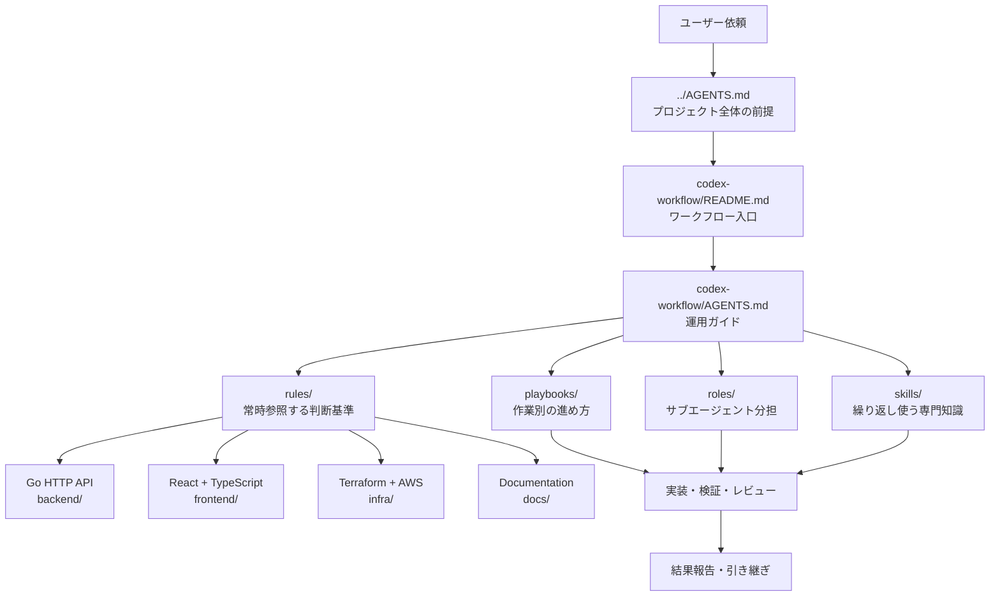
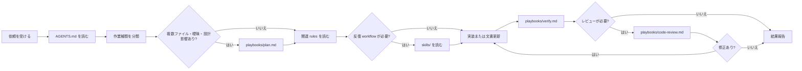

# devlab-board Codex Workflow

このディレクトリは、Codex で devlab-board の開発と運用を管理するための軽量なプロジェクトワークフローです。再利用パッケージではないため、生成された依存関係、スクリーンショット、関係のない言語ルール、ローカル環境の成果物は置きません。

## 対象範囲

- Go HTTP API のバックエンド開発
- Vite + React + TypeScript のフロントエンド開発
- Terraform による AWS IaC
- EC2 Auto Scaling、Serverless、ECS Fargate の構成比較
- docs 配下の設計、DB、運用、実装メモの作成・更新
- 境界が明確なサブエージェント作業向けの短いロール
- 計画、実装、検証、レビュー、ドキュメント、リリース準備向けの短いプレイブック

## ディレクトリ構成

```text
codex-workflow/
|-- AGENTS.md
|-- README.md
|-- rules/
|-- playbooks/
|-- roles/
`-- skills/
```

## アーキテクチャ

`codex-workflow` はアプリケーションコードを直接生成する仕組みではなく、Codex が作業前に読む判断基準と手順をまとめた運用レイヤーです。



### 各要素の役割

- `../AGENTS.md`: devlab-board 全体の前提、技術スタック、制約、検証方針。
- `AGENTS.md`: `codex-workflow/` 自体の管理運用ルール。
- `rules/`: Go、React、Terraform、AWS、documentation、security、testing などの継続的な判断基準。
- `playbooks/`: 計画、機能実装、ドキュメント運用、検証、レビュー、インフラ変更、フロントエンドリリースの手順。
- `roles/`: サブエージェントに渡すときの責務境界。
- `skills/`: Go HTTP API、React TypeScript、Terraform AWS、documentation workflow の反復作業向けガイド。

## ワークフロー構成

通常の開発では、まずプロジェクト前提を確認し、作業種類に合う playbook と rule を読み、必要な場合だけ role や skill を追加で使います。



## 使い方

1. まず `../AGENTS.md` を読む。
2. タスクに合うルールまたはプレイブックだけを読む。
3. サブエージェントを使うときだけ `roles/` を選ぶ。
4. 反復して使う作業だけ `skills/` に昇格する。
5. 新しい workflow ファイルは短く、プロジェクト固有に保つ。

## メンテナンスルール

- このスタックで使わないルールは削除する。
- 新しいルールを増やす前に、既存ルールの更新で足りるか確認する。
- 繰り返し使う安定した習慣は `skills/` に昇格する。
- `node_modules`、`dist`、Terraform state、ネストした `.git`、local logs、ビルド成果物は commit しない。
