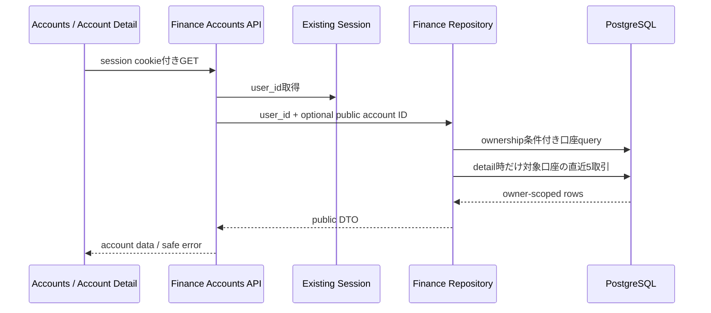

# Finance Accounts API Contract

## 1. 目的

Finance Dashboardの口座一覧と口座詳細が、現在のsession userに所属する口座だけを取得する読み取り契約を定義する。金融機関・provider接続情報は現行schemaに存在しないため、このSliceでは口座単位の表示に限定する。

## 2. Endpoints

```http
GET /api/finance/accounts
GET /api/finance/accounts/{accountId}
```

- 既存のserver-side session cookieを必須とする。
- `accountId` は口座のUUID public IDとし、内部bigint IDを受け付けない。
- clientからuser IDを受け取らず、repository queryはsessionの内部 `user_id` を必ず条件に含める。
- 一覧はMVPの少数口座を前提にpaginationを行わない。取引のfilterとcursor paginationはSlice 3で扱う。

## 3. Account shape

```json
{
  "id": "370fdd2d-aeb9-492d-a981-c40923531411",
  "name": "Synthetic Checking",
  "accountType": "checking",
  "mask": "1234",
  "currency": "JPY",
  "currentAmountMinor": "180000",
  "availableAmountMinor": "165000",
  "status": "active",
  "balanceAsOf": "2026-08-11T01:05:00Z"
}
```

契約:

- `id` はUUID public IDだけを返す。
- `accountType` は `checking`、`savings`、`credit`、`investment`、`other` のいずれかとする。
- `mask` はDBに保存した末尾最大4文字だけとし、完全な口座番号をschema、API、UI、logで扱わない。
- `currentAmountMinor` と `availableAmountMinor` はminor unit整数を表す10進文字列とし、JSON numberへ変換しない。
- `availableAmountMinor` は未取得の場合 `null` とする。
- `status` はMVPでは `active` または `closed` とする。
- 日時はISO 8601文字列とする。

## 4. Accounts list

Success:

```json
{
  "accounts": [
    {
      "id": "370fdd2d-aeb9-492d-a981-c40923531411",
      "name": "Synthetic Checking",
      "accountType": "checking",
      "mask": "1234",
      "currency": "JPY",
      "currentAmountMinor": "180000",
      "availableAmountMinor": "165000",
      "status": "active",
      "balanceAsOf": "2026-08-11T01:05:00Z"
    }
  ]
}
```

- 現在ユーザーのactive・closed口座を返す。
- activeを先にし、口座名、public IDの順で安定して並べる。
- 0件は `200` と空の `accounts` 配列を返す。

## 5. Account detail

Success:

```json
{
  "account": {
    "id": "370fdd2d-aeb9-492d-a981-c40923531411",
    "name": "Synthetic Checking",
    "accountType": "checking",
    "mask": "1234",
    "currency": "JPY",
    "currentAmountMinor": "180000",
    "availableAmountMinor": "165000",
    "status": "active",
    "balanceAsOf": "2026-08-11T01:05:00Z"
  },
  "recentTransactions": []
}
```

- `recentTransactions` はFinance Summaryと同じ公開transaction shapeを使う。
- 対象口座の取引だけを、`COALESCE(posted_at, authorized_at) DESC, id DESC`で最大5件返す。
- 全履歴、filter、sort選択、cursor paginationはSlice 3へ分離する。
- 口座は `user_id` と `public_id` を同じqueryで絞り込み、内部account IDはrepository外へ出さない。

## 6. Error contract

| 条件 | HTTP status | code |
| --- | ---: | --- |
| sessionなし | `401` | `unauthorized` |
| permission policyで禁止 | `403` | `forbidden` |
| 不正形式・不存在・他ユーザー所有のaccount ID | `404` | `finance_account_not_found` |
| 一覧のDB取得失敗 | `500` | `finance_accounts_unavailable` |
| 詳細のDB取得失敗 | `500` | `finance_account_unavailable` |

404はresourceの存在と所有者を推測できない同一status・同一bodyにする。error responseとlogへ残高、mask、取引内容、内部ID、SQL詳細を含めない。

## 7. データフロー



## 8. 要確認・ヒアリング項目

- 金融機関別groupingは `finance_connections` とprovider接続要件を導入するSliceで設計する。
- 口座数が増える実利用へ進む場合は、一覧paginationまたは上限を追加する。

## 9. 更新履歴

| 日付 | 内容 |
| --- | --- |
| 2026-08-11 | Slice 2の口座一覧・詳細・直近5取引の契約を初版作成 |
