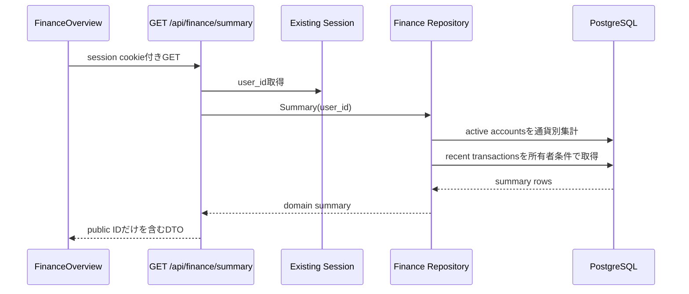

# Finance Summary API Contract

## 1. 目的

Finance Overviewが、現在のsession userに所属する口座残高と最近の取引を一度に取得する読み取り契約を定義する。

## 2. Endpoint

```http
GET /api/finance/summary
```

- 既存のserver-side session cookieを必須とする。
- request bodyとquery parameterは持たない。
- repository queryはsessionの内部 `user_id` を必ず条件に含める。
- 他ユーザーのデータや内部bigint IDをresponseへ含めない。

## 3. Success response

```json
{
  "summary": {
    "accountCount": 2,
    "balances": [
      {
        "currency": "JPY",
        "currentAmountMinor": "180000",
        "availableAmountMinor": "165000"
      }
    ],
    "recentTransactions": [
      {
        "id": "024c4ea1-e906-4f2a-a32b-f70f95762f76",
        "accountId": "370fdd2d-aeb9-492d-a981-c40923531411",
        "accountName": "Synthetic Checking",
        "name": "Grocery Store",
        "merchant": "Sample Market",
        "amountMinor": "4200",
        "currency": "JPY",
        "direction": "debit",
        "status": "posted",
        "category": {
          "code": "groceries",
          "label": "食料品"
        },
        "occurredAt": "2026-08-11T01:00:00Z"
      }
    ],
    "asOf": "2026-08-11T01:05:00Z"
  }
}
```

契約:

- `currentAmountMinor`、`availableAmountMinor`、`amountMinor` は、minor unit整数を表す10進文字列で返す。PostgreSQL `bigint` と集計結果をJSON numberへ変換しない。
- 異なる通貨は `balances` の別要素とし、APIで単純加算しない。
- 同じ通貨の有効口座にavailable balance未取得が1件でもある場合、誤った部分合計を避けるため `availableAmountMinor` を `null` とする。
- accountが0件の場合、`accountCount = 0`、配列は空、`asOf = null` とする。
- `asOf` は、集計に含まれる有効口座の `balance_as_of` のうち最も古い日時とする。合計の全構成要素に共通する保守的な基準日時であり、stale口座を最新に見せない。
- `recentTransactions` は認証ユーザーの新しい順で最大5件とする。
- `id` と `accountId` はUUIDのpublic IDとする。
- `category` と `merchant` は未設定の場合 `null` とする。

## 4. Error response

未認証:

```json
{
  "error": {
    "code": "unauthorized",
    "message": "ログインが必要です"
  }
}
```

DB取得失敗:

```json
{
  "error": {
    "code": "finance_summary_unavailable",
    "message": "Finance概要を取得できませんでした"
  }
}
```

| 状態 | HTTP status |
| --- | --- |
| success / empty | `200` |
| sessionなし | `401` |
| DB等の予期しない取得失敗 | `500` |

内部DB error、SQL、残高、取引内容をlogやerror responseへ展開しない。

## 5. データフロー



## 6. 要確認・ヒアリング項目

- 複数通貨の基準通貨換算は換算レート要件が決まるまで行わない。
- synthetic fixtureの投入方法は、専用commandまたは開発用seedとして次の変更単位で決める。

## 7. 更新履歴

| 日付 | 内容 |
| --- | --- |
| 2026-08-11 | Slice 1のFinance Summary契約を初版作成 |
| 2026-08-11 | 金額を10進文字列へ変更し、`asOf`を最古の残高日時と定義 |
