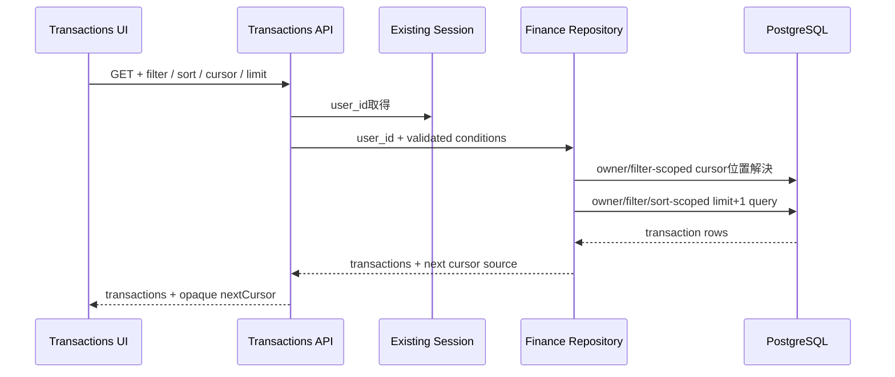

# Finance Transactions API Contract

## 1. 目的

Finance Dashboardの取引履歴として、現在のsession userに所属する取引だけを、filter、sort、cursor pagination付きで取得する契約を定義する。

## 2. Endpoint

```http
GET /api/finance/transactions?account_id=<uuid>&date_from=2026-08-01&date_to=2026-08-31&category=groceries&direction=debit&status=posted&sort=newest&cursor=<opaque>&limit=25
```

- 既存のserver-side session cookieを必須とする。
- clientからuser IDを受け取らず、全queryをsessionの内部 `user_id` で絞り込む。
- queryはすべて単一値とし、同じkeyの重複、未定義key、明示的な空文字は不正とする。

## 3. Query contract

| query | 必須 | 既定値 | 制約 |
| --- | --- | --- | --- |
| `account_id` | No | 全口座 | canonicalな公開口座UUID |
| `date_from` | No | 制限なし | `YYYY-MM-DD`。UTC暦日の開始を含む |
| `date_to` | No | 制限なし | `YYYY-MM-DD`。UTC暦日の終了を含む |
| `category` | No | 全カテゴリー | category masterのcode、または予約値 `uncategorized` |
| `direction` | No | 入出金すべて | `debit` または `credit` |
| `status` | No | 全状態 | `pending`、`posted`、`reversed` |
| `sort` | No | `newest` | `newest` または `oldest` |
| `cursor` | No | 先頭 | APIが返したopaque cursor。空文字、不正形式、不存在、他ユーザーのcursorは無効 |
| `limit` | No | `25` | 10進整数の `1..100` |

- `date_from` と `date_to` はtimezone設定を導入するまでUTC暦日として扱う。両方指定した場合は `date_from <= date_to` を必須とする。
- 日付filter、sort、cursor位置はすべて `COALESCE(posted_at, authorized_at)` を取引日時として使う。
- `newest` は取引日時と内部IDの降順、`oldest` は両方の昇順とする。
- 同一日時でも内部IDをtie-breakerとして使い、ページ間の重複と欠落を防ぐ。
- cursorは公開transaction UUIDから生成し、内部bigint ID、user ID、金融データを含めない。
- repositoryはcursor位置を同じsession userと同じfilter条件で解決する。他ユーザー・不存在・filter不一致・不正cursorを同じvalidation errorへ正規化する。
- canonical UUIDだが不存在または他ユーザー所有の `account_id` は、存在を開示せず正常な0件として扱う。
- category masterにない正しい形式のcodeは正常な0件とする。`uncategorized` は `category_code IS NULL` を表す。
- clientはcursorを解釈・生成せず、response値をそのまま次requestへ渡す。
- clientはfilterまたはsortを変更したときcursorを削除し、pagination時は他のqueryを維持する。

## 4. Category options

```http
GET /api/finance/categories
```

```json
{
  "categories": [
    { "code": "income", "label": "収入" },
    { "code": "groceries", "label": "食料品" }
  ]
}
```

- sessionを必須とする。
- `finance_transaction_categories` を `display_order ASC, code ASC` で返す。
- `uncategorized` はDB masterではなくfilter用予約値のためresponseへ含めない。
- 0件は `categories: []`、DB取得失敗は `500 finance_categories_unavailable` とする。

## 5. Success response

```json
{
  "transactions": [
    {
      "id": "024c4ea1-e906-4f2a-a32b-f70f95762f76",
      "accountId": "370fdd2d-aeb9-492d-a981-c40923531411",
      "accountName": "Synthetic Checking",
      "name": "Synthetic Grocery",
      "merchant": "Synthetic Market",
      "amountMinor": "4200",
      "currency": "JPY",
      "direction": "debit",
      "status": "posted",
      "category": {
        "code": "groceries",
        "label": "食料品"
      },
      "occurredAt": "2026-08-11T01:05:00Z"
    }
  ],
  "nextCursor": "opaque-value"
}
```

- `transactions` は既存のFinance transaction公開shapeを再利用する。
- 金額はminor unit整数の10進文字列とし、JSON numberへ変換しない。
- `merchant` と `category` は未取得の場合 `null` とする。
- `direction` は `debit` または `credit`、`status` は `pending`、`posted`、`reversed` とする。
- APIは内部で `limit + 1` 件を取得し、次ページがある場合だけ `nextCursor` を返す。
- 最終ページは `nextCursor: null`、0件は `transactions: []` とする。

## 6. Error contract

| 条件 | HTTP status | code |
| --- | ---: | --- |
| filter・sort・cursor・limit・raw queryが不正 | `400` | `finance_transactions_invalid_query` |
| sessionなし | `401` | `unauthorized` |
| permission policyで禁止 | `403` | `forbidden` |
| DB取得失敗 | `500` | `finance_transactions_unavailable` |

- validation errorは内部ID、cursor解析詳細、resourceの存在、SQL詳細を返さない。
- server logへ取引名、merchant、金額、口座ID、cursor内容を出さない。

## 7. データフロー



## 8. 対象外

- keyword検索、金額範囲、複数選択filter。
- ユーザーtimezoneによる日付境界。
- provider同期中のsnapshot pagination。
- カテゴリー編集、CSV import / export。

## 9. 更新履歴

| 日付 | 内容 |
| --- | --- |
| 2026-08-11 | Slice 3Aの取引履歴とcursor pagination契約を初版作成 |
| 2026-08-11 | Docker統合テストとブラウザ検証を完了し、実装済みに更新 |
| 2026-08-11 | Slice 3Bのfilter、sort、UTC日付境界、category options、URL・cursor契約を追加 |
