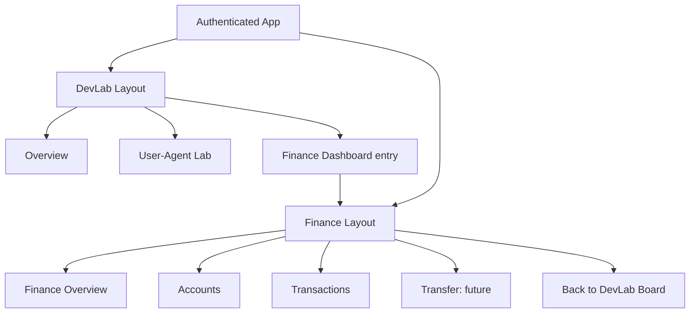
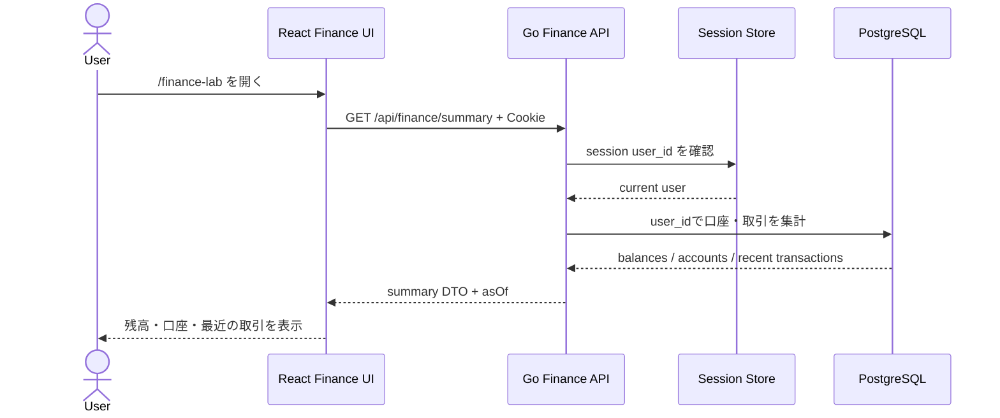
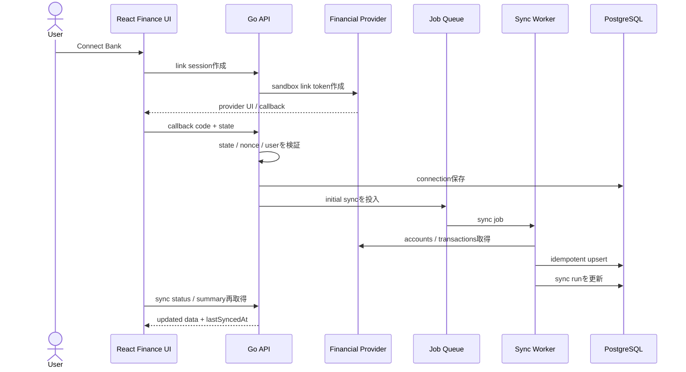
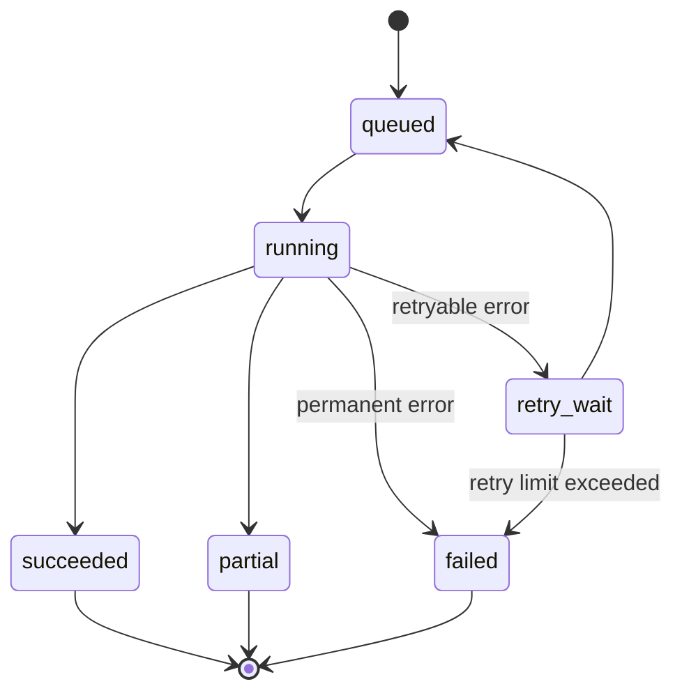
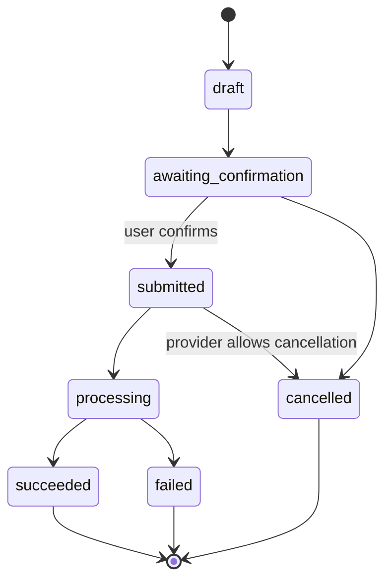
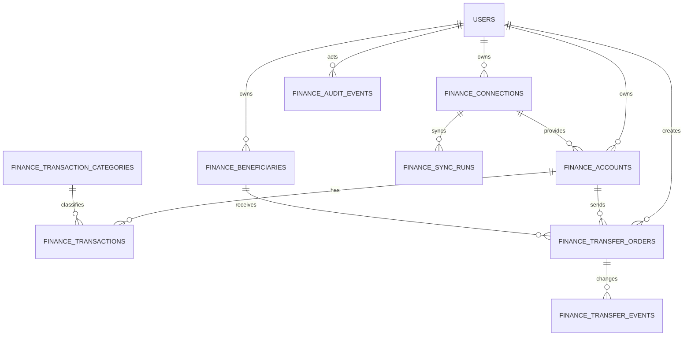
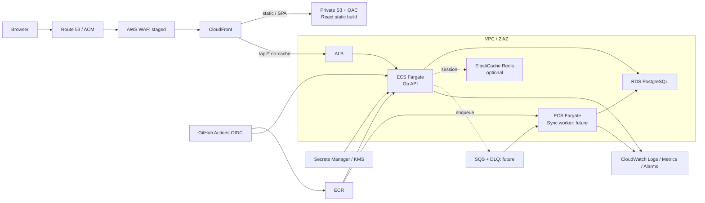

# Finance Dashboard 要件定義書

## 目次

1. [文書の目的と位置付け](#1-文書の目的と位置付け)
2. [参照元と調査結果](#2-参照元と調査結果)
3. [背景とプロダクト方針](#3-背景とプロダクト方針)
4. [対象範囲](#4-対象範囲)
5. [利用者とユースケース](#5-利用者とユースケース)
6. [情報設計と画面構成](#6-情報設計と画面構成)
7. [機能要件](#7-機能要件)
8. [主要な業務フローと状態遷移](#8-主要な業務フローと状態遷移)
9. [データ要件](#9-データ要件)
10. [API・アプリケーション境界の草案](#10-apiアプリケーション境界の草案)
11. [非機能要件](#11-非機能要件)
12. [セキュリティ・プライバシー要件](#12-セキュリティプライバシー要件)
13. [インフラ要件](#13-インフラ要件)
14. [開発・検証・リリース方針](#14-開発検証リリース方針)
15. [段階的な実装計画](#15-段階的な実装計画)
16. [受け入れ条件](#16-受け入れ条件)
17. [対象外・将来候補](#17-対象外将来候補)
18. [リスクと前提](#18-リスクと前提)
19. [今後作成する設計文書](#19-今後作成する設計文書)
20. [要確認・ヒアリング項目](#20-要確認ヒアリング項目)
21. [参照資料](#21-参照資料)
22. [更新履歴](#22-更新履歴)

## 1. 文書の目的と位置付け

本書は、`devlab-board` のサイドメニューから起動する金融管理ダッシュボード機能（以下、Finance Dashboard）の要件定義書草案である。

本書の目的は次のとおり。

- 参考動画のアプリが持つ画面、機能、機能間のつながりを整理する。
- 参考実装をそのまま複製せず、`devlab-board` の React、Go、PostgreSQL 構成へ適用する要件を定義する。
- MVP と将来機能を分け、小さな縦切りで開発できる状態にする。
- EC2 Auto Scaling、Serverless、ECS Fargate を載せ替えて比較できる共通契約を定義する。
- 未決定事項を集約し、ユーザーヒアリング後に画面、API、DB、インフラの詳細設計へ進めるようにする。

本書は承認前の草案であり、次の内容を含む。

| 区分 | 意味 |
| --- | --- |
| 現行事実 | 現在のコード、README、既存 docs で確認できる内容 |
| 推奨草案 | 調査結果を基にした現時点の推奨。ヒアリングで変更できる |
| 将来候補 | MVP には含めず、必要性と安全性を確認してから採用する内容 |
| 要確認 | ユーザー回答または追加調査が必要な内容 |

API、DB、AWS サービスの名称は、本書では責務と境界を共有するための草案として記載する。詳細な request / response、DDL、Terraform、運用手順は、本書の合意後に別文書へ分ける。

## 2. 参照元と調査結果

### 2.1 参考アプリ

参考動画は、JavaScript Mastery の「Build and Deploy a Banking App with Finance Management Dashboard Using Next.js 14」である。動画は約 6 時間 30 分で、次の章から構成される。

| 時刻 | 章 | 要件化する観点 |
| --- | --- | --- |
| 00:00:00 | Intro | アプリの目的、複数口座、リアルタイム取引、送金 |
| 00:03:31 | Setup | 開発環境と依存関係 |
| 00:20:40 | File & Folder Structure | 機能と基盤の責務分離 |
| 00:31:10 | Home Page UI | 総残高、口座数、最近の取引、右サイド情報 |
| 00:54:04 | Sidebars | 金融アプリ内ナビゲーション、モバイル導線 |
| 01:39:33 | Auth Page UI | ログイン、登録、入力検証 |
| 02:35:00 | Appwrite Authentication | 認証済み画面、セッション境界 |
| 03:23:18 | Securing the App with Sentry | エラー監視、機密情報の扱い |
| 03:36:15 | Plaid Banking Functionality | 外部金融機関との接続 |
| 04:21:17 | Dwolla Environment | 送金サービスとの接続 |
| 04:33:08 | Displaying Real Bank Data | 口座・残高・取引の取得 |
| 04:53:58 | Recent Transactions | 最近の取引、口座タブ、一覧 |
| 05:20:50 | Connect Multiple Bank Accounts | 複数金融機関・複数口座 |
| 05:25:45 | Transaction History Page | 口座別取引履歴、ページング |
| 05:33:20 | My Banks Page | 口座カードと口座詳細 |
| 05:41:47 | Transfer Payment Page | 送金フォームと入力検証 |
| 05:57:43 | Displaying Real-time Transactions | 送金結果の反映、再取得 |
| 06:03:17 | Pagination and Spending Categories | ページング、支出分類 |
| 06:18:33 | Deployment & Fixing Production Errors | デプロイと本番差分 |

公式実装で確認できる主な画面・構成は次のとおり。

- 未認証時の Sign In / Sign Up 画面。
- 認証済み領域の共通レイアウト。
- 左サイドバーの Home、My Banks、Transaction History、Transfer Funds、Connect Bank。
- Home の挨拶、接続口座数、総残高、最近の取引。
- 口座を切り替えるタブ、取引テーブル、ページング。
- 右サイドバーのユーザープロフィール、口座カード、支出カテゴリー。
- 複数銀行口座の接続、口座別取引、送金、更新結果の再表示。
- デスクトップ、タブレット、モバイル向けのレスポンシブ表示。

### 2.2 参考アプリと本プロジェクトの違い

参考アプリは Next.js、Appwrite、Plaid、Dwolla、Chart.js 等を利用する。一方、`devlab-board` では次を正とする。

- Frontend: Vite + React + TypeScript
- Backend: Go HTTP API
- Database: PostgreSQL
- Local: Docker Compose
- Infrastructure: Terraform + AWS
- Authentication: 既存の server-side session

したがって、参考アプリから採用するのは、画面構成、利用者体験、業務フロー、機能境界である。Next.js、Appwrite、Plaid、Dwolla の採用自体は要件としない。

### 2.3 現在の devlab-board

現行アプリで確認できる事実は次のとおり。

- ログイン済みユーザー向けの共通サイドバーがある。
- React Router で `/` と `/user-agent-lab` を切り替える。
- 未定義 URL は `/` へ戻す。
- Go API は `net/http` を中心に構成されている。
- `/api/*` は原則として既存セッション認証を必要とする。
- ユーザーは PostgreSQL、セッションは PostgreSQL または Redis に保存できる。
- API error は `error.code` と `error.message` を持つ共通形がある。
- PostgreSQL の `users`、`sessions` は起動時 DDL で作られる。
- Terraform は EC2 Auto Scaling 構成を中心にした骨格であり、実リソースはまだ未実装である。
- ECS Fargate の学習用 runbook と、本番候補との差分が文書化されている。

### 2.4 参考実装を要件へ読み替える際の注意

動画、README、公開デモ、公式 repository の実コードを照合すると、画面上の説明をそのまま本番要件へできない箇所がある。本書では次の差分を補正して要件化する。

| 参考実装の表現・挙動 | 実装上の確認結果 | Finance Dashboard の要件方針 |
| --- | --- | --- |
| real-time transactions | WebSocket 等の push ではなく、主に画面取得時の API call と再検証で更新する | 本当の準リアルタイム同期を行う場合は cursor、Webhook、重複排除、最終同期日時を定義する |
| transaction filtering | 主な絞り込みは口座切替で、キーワード・期間・金額・カテゴリーの複合 filter は確認できない | 必要な filter を本書の FR-TXN として個別に定義する |
| top categories | 支出金額ではなく取引件数を基に集計する箇所がある | 金額比率か件数比率かを明示し、初期推奨は指定期間の支出金額とする |
| Processing / Success | 実 provider status ではなく取引日時から推定する表示がある | pending、posted、reversed 等の source status を正規化して保持する |
| multiple bank accounts | 一つの provider 接続で取得した先頭口座だけを保存する経路がある | 一金融機関内の複数口座を扱うかを provider adapter の contract で明示する |
| shareable account ID | 内部口座 ID を Base64 化した値で、認可用 token ではない | 推測困難・失効可能・用途限定の public reference を設計し、ownership を別途検証する |
| transfer completion | 作成直後に内部取引へ記録し、provider の全 lifecycle を追跡していない | 冪等性キーと pending / succeeded / failed / cancelled の状態・event を保持する |
| external transactions | Plaid 由来取引は都度取得し、内部送金履歴と表示時に統合する | MVP は PostgreSQL を read model の正とし、外部取引と内部取引を正規化して同期する案を優先する |
| sign-up profile | 住所、生年月日、SSN 相当を入力する | synthetic / sandbox MVP では不要な PII を収集しない |
| error handling | API error 時に空表示となる箇所や、口座 0 件を十分に扱わない箇所がある | loading、empty、partial、stale、error、offline、permission を明示的に扱う |
| build quality gate | TypeScript / ESLint error を build 時に無視する設定がある | typecheck、lint、test、build を失敗させる品質 gate を別途定義する |

参考実装の外部連携フローは、概ね次の責務を持つ。

```text
Appwrite: user / session / application data
Plaid: link token -> public token -> access token -> account / transaction
Dwolla: customer -> funding source -> ACH transfer
Sentry: client / server / edge error and performance monitoring
```

これは現状把握であり、`devlab-board` で同じ製品を採用する決定ではない。provider は interface の背後へ置き、sandbox を含む正式採用は対象国、利用規約、費用、データ保持条件を確認して決める。

## 3. 背景とプロダクト方針

### 3.1 解決したいこと

Finance Dashboard は、単純な収入・支出の手入力だけを行う家計簿ではなく、複数口座、残高、取引、支出分類を一つの画面群で観察できる金融データ管理ラボとする。

同時に、`devlab-board` の目的に合わせ、次の学習対象を小さな縦切りで扱う。

- React による複数画面ダッシュボード。
- Go による認証済み API と use case 境界。
- PostgreSQL の所有者境界、一覧、集計、ページング。
- 外部サービス連携、非同期同期、再試行、Webhook。
- 金額・通貨・時刻の正しいモデリング。
- 金融データを想定したセキュリティと監査。
- 同一アプリの AWS 構成比較。

### 3.2 プロダクト原則

1. 実在する金融データを扱う前に、synthetic data と sandbox で学習する。
2. 1 機能、1 endpoint、1 画面の小さな縦切りを優先する。
3. UI、API、DB を同じ use case で縦に接続する。
4. 金額、所有者、認可、監査を後付けにしない。
5. 外部 provider と AWS runtime を domain logic から分離する。
6. AWS 構成を変えても、URL、API contract、DB の意味、ユーザー体験をできる限り維持する。
7. 参考アプリのブランド、画像、コードを無断で複製せず、構造と体験を学習対象として再設計する。

### 3.3 成功状態

初期の成功状態は、ログイン済みユーザーが `devlab-board` のサイドメニューから Finance Dashboard を開き、自分に所属するサンプル口座の総残高、口座一覧、最近の取引を確認できることである。

将来の成功状態は、sandbox の金融 provider と接続し、複数口座の同期、取引分類、送金シミュレーションまたは sandbox 送金を、安全に観察できることである。

## 4. 対象範囲

### 4.1 MVP の対象

| 優先度 | 対象 |
| --- | --- |
| Must | DevLab サイドメニューから Finance Dashboard を起動できる |
| Must | Finance 専用レイアウトと DevLab へ戻る導線がある |
| Must | 既存セッションで認証し、ユーザーごとにデータを分離する |
| Must | synthetic な金融機関、口座、取引を PostgreSQL で扱う |
| Must | 総残高、口座数、利用可能残高、最近の取引を表示する |
| Must | 口座一覧と口座別取引を表示する |
| Must | 取引一覧をページングできる |
| Must | loading、empty、error、permission 状態を表示する |
| Should | 期間、口座、カテゴリー、入出金方向で取引を絞り込む |
| Should | 支出カテゴリーの集計を表示する |
| Should | モバイルで主要な参照操作ができる |
| Could | CSV import / export |
| Could | sandbox 金融 provider との接続・同期 |
| Could | sandbox 送金 |

### 4.2 MVP 後の対象候補

- 外部金融 provider の link / OAuth flow。
- 定期同期、手動同期、再認証、接続解除。
- provider Webhook による更新通知。
- 送金先登録と sandbox 送金。
- 予算、定期支出、残高推移、通知。
- CSV / PDF statement export。
- 管理者向け監査ビュー。

### 4.3 本書で確定しないこと

- 実在銀行との本番接続。
- 実送金。
- 特定の金融 provider の正式採用。
- 金融法規、KYC / AML、決済事業者としての適法性。
- 本番 SLO、RTO、RPO、データ保持期間の最終値。
- AWS 構成の最終採用判断。

## 5. 利用者とユースケース

### 5.1 利用者

| 利用者 | MVP | 説明 |
| --- | --- | --- |
| ログインユーザー | 対象 | 自分の金融データだけを閲覧・操作する |
| 未ログインユーザー | 対象 | 既存のログイン／登録画面だけ利用できる |
| 管理者 | 将来候補 | 障害・監査を確認する。金融データの通常閲覧権限は自動付与しない |
| 外部 provider | 将来候補 | 口座・取引データ、送金状態、Webhook を提供する |
| バックグラウンド worker | 将来候補 | 同期、再試行、集計、送金状態更新を行う |

### 5.2 主要ユースケース

| ID | ユースケース | 利用者 | MVP |
| --- | --- | --- | --- |
| UC-01 | Finance Dashboard を開く | ログインユーザー | Yes |
| UC-02 | 残高概要を見る | ログインユーザー | Yes |
| UC-03 | 接続口座一覧を見る | ログインユーザー | Yes |
| UC-04 | 口座別の取引を見る | ログインユーザー | Yes |
| UC-05 | 取引を検索・絞り込みする | ログインユーザー | Partial |
| UC-06 | 支出カテゴリーを見る | ログインユーザー | Partial |
| UC-07 | 金融機関を接続する | ログインユーザー | Future |
| UC-08 | データを再同期する | ログインユーザー | Future |
| UC-09 | 送金する | ログインユーザー | Future |
| UC-10 | 接続や送金の結果を監査する | 管理者／運用者 | Future |

## 6. 情報設計と画面構成

### 6.1 ルーティング

推奨 URL は次のとおり。

```text
/
/user-agent-lab
/finance-lab
/finance-lab/accounts
/finance-lab/accounts/:accountId
/finance-lab/transactions
/finance-lab/transfer
/finance-lab/linked-banks
/finance-lab/settings
```

- `/finance-lab` は Finance Overview とする。
- `/finance-lab/overview` を設ける場合は `/finance-lab` へ redirect する。
- 未定義の `/finance-lab/*` は `/finance-lab` または Finance 用 Not Found へ戻す。
- S3 + CloudFront 配信では、`/finance-lab/*` への直接アクセスを `index.html` へ返す SPA fallback を設定する。

### 6.2 レイアウト階層

Finance Dashboard では金融アプリ専用のサイドバーが必要になる。DevLab 共通サイドバーと同時表示すると二重ナビゲーションになるため、認証境界の内側で layout を分ける。



レイアウト要件:

- 通常画面では現行 DevLab サイドバーを表示する。
- DevLab サイドバーに `Finance Dashboard` を追加する。
- `/finance-lab/*` では DevLab サイドバーを隠す。
- Finance 専用サイドバーには Home、Accounts、Transactions を表示する。
- Transfer、Linked Banks は実装済み段階で表示するか、Coming Soon と明示する。
- Finance 専用サイドバーに `DevLab Boardへ戻る` を常設する。
- モバイルでは現在の layout に対応する drawer だけを表示する。
- ブラウザの戻る／進む、直接 URL、再読込で現在画面を維持する。

### 6.3 画面一覧

| 画面 | Route | 主な表示 | 主な操作 | MVP |
| --- | --- | --- | --- | --- |
| Finance Overview | `/finance-lab` | 総残高、口座数、利用可能残高、カテゴリー、最近の取引、最終更新 | 口座切替、詳細表示 | Yes |
| Accounts | `/finance-lab/accounts` | 金融機関別・口座別一覧、マスク番号、残高、同期状態 | 口座詳細へ移動 | Yes |
| Account Detail | `/finance-lab/accounts/:accountId` | 口座情報、残高、その口座の取引 | 期間変更、一覧へ戻る | Yes |
| Transactions | `/finance-lab/transactions` | 全取引、口座、金額、状態、日時、カテゴリー | filter、sort、paging | Yes |
| Transfer | `/finance-lab/transfer` | 送金元、送金先、金額、確認、状態 | 作成、確認、取消 | Future |
| Linked Banks | `/finance-lab/linked-banks` | 接続金融機関、同期、同意期限、状態 | 接続、再認証、同期、解除 | Future |
| Settings | `/finance-lab/settings` | 通貨、timezone、通知、削除 | 設定変更 | Future |

### 6.4 Finance Overview のラフ構成

```text
+----------------------+-------------------------------------------+-------------------+
| Finance Sidebar      | Welcome / Last synced                     | User / My banks   |
|                      |                                           |                   |
| Home                 | +---------------------------------------+ | Bank card         |
| Accounts             | | Total balance / Accounts / Available  | | Bank card         |
| Transactions         | +---------------------------------------+ |                   |
| Transfer (future)    |                                           | Categories        |
| Linked banks(future) | Recent transactions                       |                   |
|                      | [Account A] [Account B]                    |                   |
| Back to DevLab       | Transaction table / Pagination            |                   |
+----------------------+-------------------------------------------+-------------------+
```

狭い画面では右サイド領域を本文下へ移動し、Finance Sidebar は drawer にする。

## 7. 機能要件

### 7.1 認証・認可

| ID | 要件 | 優先度 |
| --- | --- | --- |
| FR-AUTH-001 | Finance Dashboard は既存のログイン済みセッションで利用する | Must |
| FR-AUTH-002 | 未認証で `/finance-lab/*` または `/api/finance/*` にアクセスした場合、認証画面または `401` を返す | Must |
| FR-AUTH-003 | 全 Finance データ取得・更新は現在ユーザーの所有者境界を検証する | Must |
| FR-AUTH-004 | 他ユーザーの公開 ID を指定しても、そのデータを取得・変更できない | Must |
| FR-AUTH-005 | ログアウト時に Finance の client cache と機微な画面状態を破棄する | Must |
| FR-AUTH-006 | provider callback / Webhook は通常の session API と別の認証境界を持つ | Future |

### 7.2 ナビゲーション

| ID | 要件 | 優先度 |
| --- | --- | --- |
| FR-NAV-001 | DevLab サイドメニューから Finance Dashboard を起動できる | Must |
| FR-NAV-002 | Finance Dashboard 内に専用ナビゲーションを表示する | Must |
| FR-NAV-003 | Finance Dashboard から DevLab Board へ戻れる | Must |
| FR-NAV-004 | 現在 route に対応するメニューを active 表示する | Must |
| FR-NAV-005 | desktop、tablet、mobile でナビゲーションが利用できる | Should |
| FR-NAV-006 | keyboard と focus だけで主要 route を移動できる | Must |

### 7.3 残高概要

| ID | 要件 | 優先度 |
| --- | --- | --- |
| FR-SUM-001 | ユーザーに所属する有効口座数を表示する | Must |
| FR-SUM-002 | 対象口座の current balance 合計を表示する | Must |
| FR-SUM-003 | available balance がある場合は current balance と区別して表示する | Must |
| FR-SUM-004 | 集計通貨と基準日時 `asOf` / `lastSyncedAt` を表示する | Must |
| FR-SUM-005 | 最近の取引を既定件数だけ表示する | Must |
| FR-SUM-006 | 支出カテゴリー別の金額または件数を表示する | Should |
| FR-SUM-007 | 一部データ取得に失敗しても、取得済み領域を partial data として表示できる | Should |

### 7.4 口座管理

| ID | 要件 | 優先度 |
| --- | --- | --- |
| FR-ACC-001 | ユーザーの金融機関と口座を一覧表示する | Must |
| FR-ACC-002 | 口座名、種別、通貨、マスク済み番号、残高、状態を表示する | Must |
| FR-ACC-003 | 完全な口座番号を画面、API、ログへ出さない | Must |
| FR-ACC-004 | 口座を選択して、その口座の取引を表示できる | Must |
| FR-ACC-005 | closed、disconnected、reauth_required 等の状態を表示できる | Future |
| FR-ACC-006 | 複数金融機関と複数口座を一人のユーザーへ関連付けられる | Should |

### 7.5 取引履歴

| ID | 要件 | 優先度 |
| --- | --- | --- |
| FR-TXN-001 | 自分の全取引を新しい順に表示する | Must |
| FR-TXN-002 | 取引名、merchant、金額、通貨、入出金方向、状態、日時、カテゴリーを表示する | Must |
| FR-TXN-003 | pending、posted、reversed を区別できる | Should |
| FR-TXN-004 | 取引一覧をページングできる | Must |
| FR-TXN-005 | 口座、期間、カテゴリー、入出金方向、状態で絞り込める | Should |
| FR-TXN-006 | キーワード検索と sort を行える | Could |
| FR-TXN-007 | filter と pagination を URL query に反映し、再読込と戻る操作で維持する | Should |
| FR-TXN-008 | 同一 provider event を重複登録しない | Future |

### 7.6 支出カテゴリー

| ID | 要件 | 優先度 |
| --- | --- | --- |
| FR-CAT-001 | 取引カテゴリーを表示する | Should |
| FR-CAT-002 | 指定期間の支出をカテゴリー別に集計する | Should |
| FR-CAT-003 | chart だけでなく、数値・ラベルでも内容を理解できる | Must |
| FR-CAT-004 | provider category とアプリ表示 category を変換できる境界を持つ | Future |
| FR-CAT-005 | ユーザーによるカテゴリー修正はヒアリング後に決定する | Pending |

### 7.7 金融機関接続・同期

| ID | 要件 | 優先度 |
| --- | --- | --- |
| FR-LINK-001 | provider の sandbox を使って金融機関接続を開始できる | Future |
| FR-LINK-002 | callback の state、nonce、期限、ユーザー対応を検証する | Future |
| FR-LINK-003 | provider credential を frontend に公開しない | Must |
| FR-LINK-004 | 接続済み金融機関、同意期限、最終同期、状態を表示する | Future |
| FR-SYNC-001 | 手動または定期で口座・取引を同期できる | Future |
| FR-SYNC-002 | 同期は idempotent な upsert とする | Future |
| FR-SYNC-003 | 同期状態を queued、running、succeeded、partial、failed で追跡する | Future |
| FR-SYNC-004 | provider timeout、rate limit、一時障害を分類して再試行する | Future |
| FR-SYNC-005 | 永続失敗は dead-letter 相当へ移し、運用者が検出できる | Future |

### 7.8 送金

送金はリスクが高いため、MVP では対象外とし、まず UI simulation または provider sandbox に限定する。

| ID | 要件 | 優先度 |
| --- | --- | --- |
| FR-TRF-001 | 送金元口座、送金先、金額、通貨、メモを入力できる | Future |
| FR-TRF-002 | 入力後に確認画面を表示し、明示確認後だけ送信する | Future |
| FR-TRF-003 | `Idempotency-Key` により二重送金を防ぐ | Future |
| FR-TRF-004 | 所有権、利用可否、金額上限、通貨、送金先を backend で検証する | Future |
| FR-TRF-005 | 状態を draft、awaiting_confirmation、submitted、processing、succeeded、failed、cancelled で追跡する | Future |
| FR-TRF-006 | 状態変更を append-only event と監査ログに残す | Future |
| FR-TRF-007 | sandbox / simulation であることを画面上に明示する | Future |

### 7.9 監査・運用

| ID | 要件 | 優先度 |
| --- | --- | --- |
| FR-AUD-001 | 接続、再認証、同期、解除、送金の重要操作を監査対象にする | Future |
| FR-AUD-002 | audit event は actor、action、target、result、request ID、日時を持つ | Future |
| FR-AUD-003 | audit event に token、完全な口座番号、raw payload を保存しない | Must |
| FR-AUD-004 | 外部データ export / download を実装する場合は権限と監査を必須にする | Future |

## 8. 主要な業務フローと状態遷移

### 8.1 Dashboard 読み取り



### 8.2 銀行接続と同期



### 8.3 同期状態



### 8.4 送金状態



残高と取引は provider 由来の snapshot であり、強い整合性を持つ銀行台帳そのものではない可能性がある。画面には基準日時を表示し、送金完了と取引反映が同時であると仮定しない。

## 9. データ要件

### 9.1 概念モデル



MVP は共有テーブルの `users` と、`finance_connections`、`finance_accounts`、`finance_transactions`、`finance_transaction_categories` の必要最小限から開始する。provider 未接続時の `finance_connections` は `provider = synthetic` として扱うか、省略可能な関係として詳細設計で決める。

### 9.2 テーブル命名規則

Finance Dashboard だけが使用するテーブルには、必ず `finance_` プレフィックスを付ける。サフィックス方式も識別要件は満たすが、一覧表示時にFinance関連テーブルがまとまり、SQL・migration・運用画面で検索しやすいため、本プロジェクトではプレフィックス方式へ統一する。

| 利用範囲 | 命名規則 | 例 |
| --- | --- | --- |
| Finance Dashboard 専用 | `finance_<複数形の対象名>` | `finance_accounts`、`finance_transactions` |
| DevLab Board と Finance Dashboard の共有 | 機能プレフィックスなし | `users`、`sessions` |
| 他のlab・機能専用 | その機能で定めた明示的なプレフィックス | Finance用の `finance_` は付けない |

補足ルール:

- `financial_`、`fin_`、`*_finance` 等を混在させず、新規Finance専用テーブルは `finance_` に統一する。
- 共有テーブルを参照する場合、Finance専用テーブル側に `user_id` 等の外部キーを持たせる。Finance用ユーザーを別管理する明確な要件がない限り、`finance_users` は作成せず、共有 `users` を参照する。
- `users` や `sessions` が将来Finance専用になった場合、またはFinance固有のプロフィールを分離する場合は、用途を再確認して `finance_user_profiles` 等を追加する。
- 当初Finance専用だったテーブルを全体共有へ昇格する場合は、単純なrenameではなく、参照元、権限、migration、rollbackを設計してから無印の共有名へ移す。
- table、constraint、index、migration file、repository名で同じdomain用語を使う。物理名の最終一覧はDB設計書で確定する。

### 9.3 エンティティ候補

| Entity | 主な属性 | MVP |
| --- | --- | --- |
| users | 既存 user、public ID、email、role | Existing |
| finance_connections | user、provider、institution、provider reference、status、consent、last sync | Partial |
| finance_accounts | user、connection、name、type、mask、currency、current / available balance、status | Yes |
| finance_transactions | user、account、provider reference、amount、direction、merchant、category、authorized / posted time、status | Yes |
| finance_transaction_categories | code、label、display order | Yes |
| finance_sync_runs | connection、status、started / finished、counts、retry、error class | Future |
| finance_beneficiaries | user、name、masked destination、provider reference、status | Future |
| finance_transfer_orders | source、beneficiary、amount、currency、status、idempotency、provider reference | Future |
| finance_transfer_events | transfer、old / new status、reason、timestamp | Future |
| finance_audit_events | actor、action、target、result、request ID、timestamp | Future |

### 9.4 金額・通貨

- JavaScript / Go / DB で binary floating point を金額の正として使わない。
- 初期案は `BIGINT amount_minor` と ISO 4217 `currency` の組み合わせとする。
- UI 表示時に minor unit から locale 対応文字列へ変換する。
- 入出金方向と符号の意味を一つに統一する。
- 複数通貨の総残高は、換算レートと基準日時を決めるまで単純加算しない。
- 端数、丸め、手数料、為替差は実送金前に別途定義する。

### 9.5 ID と所有者境界

- 内部 ID は bigint を使用できる。
- API へ公開する ID は UUID 等の推測困難な public ID とする。
- repository query は `user_id` を条件に含める。
- 存在するが他ユーザー所有の resource は、情報漏えいを避けるため `404` とする案を優先する。
- provider reference は connection 単位または provider と組み合わせて unique にし、再同期を冪等にする。

### 9.6 Index 候補

- `finance_accounts(user_id, status)`
- `finance_transactions(user_id, posted_at DESC, id DESC)`
- `finance_transactions(account_id, posted_at DESC, id DESC)`
- `finance_transactions(user_id, category_code, posted_at DESC)`
- `finance_connections(user_id, provider, provider_item_ref)` unique
- `finance_transactions(account_id, provider_transaction_ref)` unique
- `finance_sync_runs(connection_id, started_at DESC)`
- `finance_transfer_orders(user_id, created_at DESC)`
- `finance_transfer_orders(idempotency_key)` unique

Index は実 query と `EXPLAIN` を確認して確定し、想定だけで増やしすぎない。

### 9.7 データ分類と保持

| 分類 | 例 | 方針 |
| --- | --- | --- |
| Public | 画面ラベル、カテゴリー名 | 通常データ |
| Internal | synthetic transaction、request ID | 必要範囲で保存 |
| Confidential | email、残高、取引、口座 mask | 最小保存、認可、暗号化、ログ抑制 |
| Secret | password、session token、provider token、DB credential | secret store、非表示、非ログ、非commit |

- fixtures、docs、tests には synthetic data だけを使う。
- 実在する氏名、メール、口座番号、取引履歴をサンプルへ使用しない。
- 接続解除時の履歴保持・削除はヒアリング後に決定する。
- retention と delete request を実データ連携前に定義する。

### 9.8 Migration

現行の起動時 `CREATE TABLE IF NOT EXISTS` は初期学習には適するが、Finance schema と複数 runtime の運用には不十分である。

- Finance の最初の schema 追加時に versioned migration tool を導入する案を推奨する。
- AWS 環境ではアプリ起動と migration を分離する。
- migration user と application user を分ける。
- 複数 task / instance / Lambda が同時に DDL を実行しない。
- rollback は code と schema の互換期間を考慮する。

## 10. API・アプリケーション境界の草案

### 10.1 API 候補

読み取り:

```http
GET /api/finance/summary
GET /api/finance/accounts
GET /api/finance/accounts/{accountId}
GET /api/finance/accounts/{accountId}/transactions
GET /api/finance/transactions
GET /api/finance/categories
```

外部接続・同期:

```http
GET    /api/finance/connections
POST   /api/finance/connections/link-session
POST   /api/finance/connections/callback
POST   /api/finance/connections/{connectionId}/sync
DELETE /api/finance/connections/{connectionId}
GET    /api/finance/sync-runs/{syncRunId}
```

送金:

```http
POST /api/finance/transfers
GET  /api/finance/transfers/{transferId}
POST /api/finance/transfers/{transferId}/cancel
```

取引 query 候補:

```text
account_id
date_from
date_to
category
direction
status
query
cursor
limit
sort
```

### 10.2 Response 方針

- API response type は frontend の画面ごとに重複定義せず、Finance API boundary へ集約する。
- 金額は `amountMinor` と `currency` を返す。
- 日時は ISO 8601 とし、timezone の意味を定義する。
- 残高・集計には `asOf` または `lastSyncedAt` を含める。
- 一覧は cursor pagination を優先し、`nextCursor` を返す。
- provider の raw response をそのまま公開しない。

### 10.3 Error 方針

既存 error shape を継続する。

```json
{
  "error": {
    "code": "validation_error",
    "message": "入力内容を確認してください",
    "fields": [],
    "requestId": "optional",
    "retryable": false
  }
}
```

status code 候補:

| Status | 用途 |
| --- | --- |
| 200 | 読み取り、同期済み操作 |
| 201 | connection / transfer 作成 |
| 202 | 非同期同期・送金受付 |
| 400 | JSON、query、形式不正 |
| 401 | session なし |
| 403 | role 等による禁止 |
| 404 | resource なし、または所有者境界を隠す |
| 409 | 重複、状態競合、idempotency conflict |
| 422 | field validation |
| 429 | rate limit / provider limit |
| 502 | provider response 不正・障害 |
| 503 | 一時利用不能 |

### 10.4 Backend 境界

Finance 機能は、規模を考慮して `internal/finance` 等の機能境界へ分ける案を推奨する。

```text
HTTP handler
  -> Finance use case
      -> Account / Transaction repository interfaces
      -> Provider interface
      -> Queue interface
      -> Audit interface
          -> PostgreSQL / provider SDK / AWS adapter
```

- HTTP handler に SQL、provider SDK、queue 送信を直接書かない。
- use case は AWS runtime に依存させない。
- provider 固有 ID と raw shape は adapter で domain model へ変換する。
- background worker は API process と論理的に分離する。
- 既存 gRPC lab は Finance MVP の必須依存にしない。

### 10.5 Frontend 状態管理

| 状態 | 推奨手段 | 例 |
| --- | --- | --- |
| Local state | `useState` | drawer、tab、未送信 form、modal |
| URL state | React Router query | filter、sort、pagination、選択口座 |
| Server state | TanStack Query | summary、accounts、transactions、sync status |
| Shared client state | Jotai を必要時に導入 | 表示通貨、Finance sidebar preference |

- server state を Atom や複数 `useState` へ重複保存しない。
- filter を query key に含める。
- mutation 成功時に関連 query を invalidate する。
- logout 時に query cache を clear する。
- TanStack Query と Jotai は、必要になる Slice で初めて追加する。

## 11. 非機能要件

### 11.1 UX 状態

各データ領域は、必要に応じて次を区別する。

- initial loading
- background refreshing
- empty
- partial data
- stale data / last synced
- recoverable error + retry
- offline
- permission denied
- provider re-authentication required

Dashboard 全体を一つの error で隠さず、残高、最近の取引、カテゴリーなどの部分失敗を表現できることが望ましい。

### 11.2 性能目標の初期案

次は確定 SLO ではなく、最初に測定するための暫定目標である。

| 対象 | 暫定目標 |
| --- | --- |
| Summary API | warm p95 500 ms 以内 |
| Transactions API | warm p95 800 ms 以内 |
| 一覧既定件数 | 25 件 |
| 一覧最大件数 | 100 件 |
| Frontend | 主要コンテンツと追加領域を段階表示できる |
| DB | 一覧 query で不要な full scan を避ける |

frontend、API、DB、provider の待ち時間は分けて観測する。

### 11.3 可用性・回復性

- Go API は graceful shutdown を行う。
- `/healthz` は process alive、将来の `/readyz` は依存 resource の準備状態を表す。
- provider call に timeout を設定する。
- retryable error は exponential backoff と jitter を使う。
- duplicate job と duplicate event に耐える。
- 非同期 job は retry limit と dead-letter path を持つ。
- RDS backup と restore test を行う。
- RTO / RPO は環境別にヒアリング後に確定する。

### 11.4 観測性

最低限の共通ログ項目:

- timestamp
- level
- environment
- infrastructure variant
- service / revision
- request / correlation ID
- route
- status
- latency
- error class

監視候補:

- frontend / API の 4xx・5xx。
- API latency、DB connection、slow query。
- provider latency、error、rate limit。
- sync success、failure、lag、retry、dead letter。
- transfer status の滞留。
- task / instance / Lambda の異常。
- RDS CPU、storage、connections、latency、backup。

### 11.5 アクセシビリティ

- input、filter、button、navigation に label を付ける。
- keyboard 操作と visible focus を提供する。
- 収入・支出・状態を色だけで区別しない。
- chart に数値または table の代替を提供する。
- loading と error を支援技術へ通知する。
- mobile で横スクロールが必要な table は、意味を失わない代替表示を検討する。

### 11.6 互換性・可搬性

- 現行の主要ブラウザで動作する。
- frontend は静的 build 可能である。
- API origin は環境設定でき、secret を frontend bundle へ入れない。
- EC2、ECS、Lambda の runtime 差を handler / domain へ漏らさない。
- PostgreSQL schema と API contract を infrastructure variant 間で維持する。

## 12. セキュリティ・プライバシー要件

### 12.1 Session と CSRF

- 既存 server-side session を継続する。
- Cookie は本番で `HttpOnly`、`Secure`、適切な `SameSite`、domain、path を明示する。
- login 時の session token renewal を維持する。
- state-changing API の追加前に CSRF token または厳格な Origin 検証を導入する。
- session token を local storage に保存しない。
- same-origin 配信を優先し、CORS 対象を最小化する。

### 12.2 認可

- `/api/finance/*` は原則すべて認証必須とする。
- `role == user` の確認だけでなく、resource ごとの ownership を検証する。
- repository query 自体を `user_id` で制限する。
- provider callback / Webhook は署名、state、timestamp、replay を検証する。
- transfer、sync、connection、auth は rate limit 対象とする。

### 12.3 Secret と暗号化

- DB credential、provider credential、Redis credential は Secrets Manager 等から runtime 注入する。
- provider access token を frontend、Git、Terraform variable、container image、log に置かない。
- token を DB に保存する必要がある場合は、KMS 等を使った envelope encryption と key rotation を設計する。
- S3、RDS、EBS、Secrets、logs は at-rest encryption を有効化する。
- viewer、origin、DB の通信を TLS 化する。

### 12.4 ログ抑制

次を application log と audit log に記録しない。

- password / password hash
- session token / Cookie / Authorization
- provider access token / refresh token
- 完全な口座番号
- transfer request body 全文
- provider raw response
- 不要な氏名、住所、メール

### 12.5 実データ利用前のゲート

実在する金融データまたは実送金を扱う前に、少なくとも次を完了する。

- Threat modeling。
- provider 利用規約、対象国、法務、個人情報の確認。
- MFA、email verification、password reset の要否決定。
- CSRF、rate limit、監査、incident response。
- retention、削除、export、consent の定義。
- backup、restore、RTO、RPO の合意。
- vulnerability / dependency / image scan。
- production access control と運用者権限。

## 13. インフラ要件

### 13.1 基本方針

本書では ECS Fargate 構成を現時点の推奨リファレンスとする。ただし、これは Finance Dashboard の唯一の実行環境ではない。

`devlab-board` は、同一アプリを EC2 Auto Scaling、Serverless、ECS Fargate 等へ載せ替え、構成ごとの deploy、network、IAM、observability、scale、rollback、cost、運用負荷を比較する学習基盤である。

そのため、次をインフラ共通要件とする。

- infrastructure variant の比較実験は `experiment/aws-*` ブランチへ分けられ、安定した変更は `infra/*` または `feature/*` から `develop` へ統合する。
- variant ごとに Terraform root、state、URL、tag、DB を分離できる。
- 機能要件、HTTP API、DB の意味、認証 semantics を variant 間で維持する。
- 構成固有コードは adapter / platform layer に閉じ込める。
- 一つの variant の都合で domain model を変更しない。
- 比較実験として別 DB 製品等を使う場合は、標準契約から外れる派生実験と明示する。

### 13.2 推奨リファレンス構成



推奨理由:

- 現行 Go HTTP server と container の差分が小さい。
- graceful shutdown と connection pool をそのまま観察できる。
- frontend を S3 + CloudFront へ分離できる。
- CloudFront の `/api/*` behavior で same-origin にしやすい。
- PostgreSQL 方針を RDS で維持できる。
- 将来の sync / transfer worker を ECS service または task として分離しやすい。

最初の dev 環境では cost と学習範囲を抑えるため、internet-facing ALB、desired count 1、RDS Single-AZ 等を採用できる。ただし、学習用簡略構成であることを明示し、実データや第三者公開には使わない。

### 13.3 構成比較

| 観点 | EC2 Auto Scaling | Serverless | ECS Fargate |
| --- | --- | --- | --- |
| Frontend | S3 + CloudFront | S3 + CloudFront | S3 + CloudFront |
| API | ALB + EC2 ASG | API Gateway + Lambda | ALB + ECS Service |
| Go 差分 | HTTP binary | Lambda adapter | HTTP container |
| Database | RDS PostgreSQL | RDS / Aurora PostgreSQL + RDS Proxy 候補 | RDS PostgreSQL |
| Session | PostgreSQL / Redis | PostgreSQL / Redis 等を別途評価 | PostgreSQL / Redis |
| Async | SQS + worker on EC2 | SQS + Lambda | SQS + ECS worker |
| Scale | ASG target tracking | request / event 単位 | ECS Service Auto Scaling |
| Deploy | AMI / artifact + Instance Refresh | Lambda version / alias | task definition revision |
| Rollback | 旧 AMI / Launch Template | 旧 version / alias | 旧 task definition |
| 主な学習 | OS、AMI、capacity、agent | cold start、timeout、DB connection | container、ECR、service、rolling deploy |
| 初期適合度 | 比較対象 | 比較対象 | 推奨リファレンス |

### 13.4 URL と edge contract

- ユーザー公開 URL は原則一つの origin とする。
- `/*` と `/finance-lab/*` は React SPA。
- `/api/*` は動的 API とし、CloudFront / API Gateway で cache しない。
- `/healthz` は認証不要で機密情報を返さない。
- 将来 `/readyz` を分ける。
- variant 別 URL 例は `ecs.dev.example.com`、`ec2.dev.example.com`、`serverless.dev.example.com` とする。
- domain 未採用段階は CloudFront generated domain を利用できる。
- API behavior は必要な Cookie、header、query を origin へ転送する。

### 13.5 Network

- stg / prod は 2 AZ を基本とする。
- RDS は private DB subnet に置き、public access を無効にする。
- ECS task / EC2 instance は private subnet を原則とする。
- 公開入口は CloudFront に集約する。
- 推奨 prod 案は CloudFront VPC origin + internal ALB とする。
- 最初の学習段階で internet-facing ALB を使う場合は、HTTPS と CloudFront 以外からの直接アクセス制限を設計する。
- Security Group は CloudFront / ALB / app / RDS の経路を参照で限定する。
- NAT Gateway と VPC endpoint は固定費を比較して選択する。
- CloudFront VPC origin は region、Availability Zone、protocol 等に制約があるため、採用時点の AWS 公式仕様を確認する。特に gRPC は同経路へ混在させず、既存 gRPC lab は別 origin / 別公開経路として評価する。

### 13.6 Database / backup

- PostgreSQL を構成共通の正とする。
- variant ごとに独立 DB、database、または schema を使い、destroy と性能比較の相互干渉を避ける。
- app user と migration user を分ける。
- RDS automated backup と PITR を有効化する。
- dev は短期保持、prod は要件に応じた保持期間とする。
- deletion protection、final snapshot、manual snapshot を環境ごとに定義する。
- 定期 restore test を行う。
- 初期 DR は single Region の backup-and-restore を推奨する。
- cross-Region は RTO / RPO により必要になった場合だけ採用する。

### 13.7 IAM / OIDC / secret

最低限、次の role を分ける。

- GitHub plan role
- GitHub deploy / apply role
- ECS task execution role
- application task role
- EC2 instance role
- Lambda execution role
- migration role
- human operator / read-only role

- GitHub Actions は OIDC で短期 credential を取得する。
- IAM trust policy は repository、branch / tag、GitHub Environment へ制限する。
- 長期 access key を GitHub Secrets に保存しない。
- runtime role は必要な secret ARN、queue、log 等だけへ最小権限を持つ。
- RDS master password は Secrets Manager 管理を候補とする。

### 13.8 Terraform state と branch

推奨ディレクトリ草案:

```text
infra/
  bootstrap/
  ec2-asg/
    envs/dev/
    envs/stg/
    envs/prod/
  serverless/
    envs/dev/
    envs/stg/
    envs/prod/
  ecs-fargate/
    envs/dev/
    envs/stg/
    envs/prod/
```

- `variant × env` ごとに Terraform state を完全分離する。
- EC2、Serverless、ECSの比較ブランチから同じstateを操作しない。
- branch 名だけでなく、state key、resource name、tag、URL に variant を持たせる。
- ブランチの作成元、merge先、命名、release運用は [`git-branch-strategy.md`](./git-branch-strategy.md) に従う。
- backend bootstrap は application state と分ける。
- S3 backend は encryption、Block Public Access、versioning、least privilege、locking を持つ。
- plan file は secret を含み得るため、非公開・短期保持とする。
- branch 削除前に AWS resource を維持するか destroy するか記録する。
- Terraform / AWS Provider の標準 version は正式実装前に統一する。
- 現時点では repository root の指定と ECS runbook の例で Terraform / AWS Provider の version 方針が異なるため、実装開始前に一つの lock / upgrade 方針へ揃える。

### 13.9 環境分離

| 環境 | データ | 公開 | 可用性 | 寿命 |
| --- | --- | --- | --- | --- |
| local | synthetic | localhost | Docker Compose | 常設 |
| dev | synthetic | 認証／制限付き | 1 task、Single-AZ 可 | stop / destroy 可 |
| preview / handson | synthetic のみ | `/32` 等 | 最小構成 | TTL 必須 |
| stg | synthetic / anonymized | 認証必須 | 2 AZ、本番相当 | 常設候補 |
| prod | 要件確定後 | HTTPS / WAF | 2 AZ、Multi-AZ 候補 | 常設 |

- 可能なら prod と non-prod の AWS account を分ける。
- 少なくとも VPC、state、secret、DB、bucket、log group、URL を分ける。
- `ap-northeast-1` を既定候補とするが、region 比較は別 variant / state で許容する。
- preview へ実データを複製しない。

### 13.10 Cost

- 全 resource に `Project`、`Environment`、`Variant`、`ManagedBy`、`Owner`、`ExpiresAt` を付与する。
- AWS Budgets と Cost Anomaly Detection を利用する。
- dev / preview は TTL または destroy checklist を持つ。
- NAT Gateway、ALB、RDS、Public IPv4、Secrets Manager、WAF、CloudWatch Logs を比較費用に含める。
- dev では短い log retention、Single-AZ、desired count 1 を許容する。
- variant 比較は同じ region、期間、負荷、DB 条件、データセットで行う。

## 14. 開発・検証・リリース方針

### 14.1 開発原則

- 変更は一つのユーザー価値を frontend / API / DB で縦に通す。
- 大きな先回りを避け、実際に必要になった interface だけを追加する。
- 参考実装のコードをコピーせず、`devlab-board` の規約で実装する。
- 外部 provider と AWS は sandbox / dev から始める。
- 機能・API・DB・AWS の安定した決定は docs と ADR に残す。

### 14.2 Test

Backend:

- handler status / error shape。
- repository CRUD と ownership。
- summary aggregation。
- transaction filter / pagination。
- 他ユーザー resource の拒否。
- duplicate provider event / idempotency。
- transfer state transition。

Frontend:

- route と layout 切替。
- loading、empty、error、permission。
- filter と URL query。
- logout 後の cache clear。
- keyboard / focus。
- responsive layout。

Infrastructure:

- `terraform fmt -check -recursive`。
- `terraform validate`。
- 可能な環境で `terraform plan`。
- public exposure、IAM、replace / destroy、cost の review。
- deploy 後の共通 smoke test。

### 14.3 CI/CD

- GitHub Actions から AWS へ OIDC で接続する。
- plan と apply の role と workflow を分ける。
- prod apply は GitHub Environment と明示承認を使う。
- frontend typecheck / lint / test / build、Go test、Terraform check、security scan を、script の導入段階に応じて PR で実行する。
- migration と application deploy を分離する。
- migration 失敗時は rollout を停止する。
- rollback は code、container / artifact、schema compatibility を対象にする。
- variant ごとに同じ smoke test を実行する。

### 14.4 共通 smoke test

- `/` を表示できる。
- login / logout できる。
- `/finance-lab` へ移動できる。
- direct link と SPA fallback が動作する。
- `/healthz` が成功する。
- 認証済み `GET /api/finance/summary` が成功する。
- 他ユーザーの account を取得できない。
- logs に secret と完全な金融情報が出ていない。

## 15. 段階的な実装計画

### Phase 0: ヒアリングと要件承認

- 本書の要確認事項へ回答する。
- MVP と将来範囲を確定する。
- synthetic / sandbox / real data の境界を確定する。
- 最初の AWS variant を決める。

### Slice 1: Finance 入口と残高概要

- DevLab メニューへ Finance Dashboard を追加。
- `/finance-lab` 専用 layout と戻る導線。
- synthetic 口座・取引の最小 schema。
- `GET /api/finance/summary`。
- 総残高、口座数、最近の取引。
- session と ownership。
- loading、empty、error。

### Slice 2: 口座一覧・詳細

- `GET /api/finance/accounts`。
- `GET /api/finance/accounts/{accountId}`。
- account card、mask、status。
- account detail と口座別取引。
- 他ユーザー account の拒否 test。

### Slice 3: 取引履歴

- `GET /api/finance/transactions`。
- filter、sort、cursor pagination。
- URL query と server state。
- DB index と query plan。

### Slice 4: 支出集計

- category master / mapping。
- 期間集計。
- chart と数値代替。
- timezone、currency、asOf。

### Slice 5: Sandbox 金融機関接続

- provider interface と sandbox adapter。
- link / OAuth flow。
- encrypted credential reference。
- sync job、worker、`finance_sync_runs`。
- retry、Webhook、idempotent upsert。

### Slice 6: Sandbox 送金

- CSRF、rate limit、監査を先に完成。
- beneficiary、transfer order / event。
- confirm、idempotency、state transition。
- simulation / sandbox の明示。

### Slice 7: 推奨 ECS Fargate dev

- S3、CloudFront、ECR、ECS、ALB、RDS、Secrets Manager、CloudWatch。
- 同一 origin と Secure Cookie。
- migration job。
- smoke test と rollback。

### Slice 8: AWS variant 比較

- EC2 Auto Scaling variant。
- Serverless variant。
- 同一 contract とデータ条件で比較。
- latency、deploy、rollback、recovery、cost、運用作業を記録。
- 結果を ADR へ残す。

## 16. 受け入れ条件

### 16.1 Slice 1 の受け入れ条件

- ログイン済みユーザーが DevLab サイドバーから Finance Dashboard を開ける。
- Finance 専用 layout だけが表示され、DevLab へ戻れる。
- `/finance-lab` を再読込して同じ画面を表示できる。
- summary は PostgreSQL の現在ユーザーのデータだけを集計する。
- 金額と通貨を正しく表示する。
- account が 0 件の場合は empty state を表示する。
- API error 時は retry 可能な error state を表示する。
- 未認証 API は `401` を返す。
- 他ユーザーのデータを取得できない。
- Backend test と frontend build が成功する。

### 16.2 MVP 全体の受け入れ条件

- Overview、Accounts、Account Detail、Transactions を移動できる。
- 総残高、口座数、最近の取引、口座別取引が整合する。
- 取引をページングできる。
- 主要 filter が URL と同期する。
- loading、empty、error、permission が確認できる。
- 完全な口座番号、password、token が UI / API / log に出ない。
- Finance専用テーブルがすべて `finance_` プレフィックスに従い、共有テーブルだけが無印である。
- desktop と mobile で主要閲覧操作ができる。
- synthetic data でローカルの一連の動作を再現できる。

### 16.3 AWS variant の受け入れ条件

- 同じ frontend build と API contract で主要フローを実行できる。
- variant 固有 state、URL、tag、DB が分離されている。
- `/healthz` と認証済み summary smoke test が成功する。
- secrets が repository、plan artifact、frontend bundle、log に露出しない。
- rollback path と destroy / retain 判断が文書化されている。
- 比較結果を同じ測定条件で記録できる。

## 17. 対象外・将来候補

MVP 対象外:

- 実銀行の本番 credential。
- 実送金、振込、資金移動。
- KYC / AML。
- クレジット審査、融資、投資、証券、暗号資産。
- 複数通貨の自動換算。
- 家族・組織・共同口座の権限モデル。
- statement の PDF 生成。
- 管理者による金融データの通常閲覧。
- production の multi-Region active-active。

将来候補:

- budget、目標、定期支出、異常支出検知。
- CSV import / export。
- notification。
- user-defined category / tag / memo。
- account balance trend。
- provider comparison。
- Webhook / queue / worker の runtime 比較。
- read model / cache / analytics store の比較。

## 18. リスクと前提

| リスク | 影響 | 対応 |
| --- | --- | --- |
| 参考アプリをそのまま本番品質と誤認する | セキュリティ・法務不足 | 学習用 UI と実金融サービスを明確に分ける |
| 実データを早期に扱う | 情報漏えい・規約違反 | synthetic / sandbox gate を設ける |
| 二重サイドバー | 操作混乱・狭い本文 | route layout を分ける |
| 起動時 DDL | 同時起動競合・rollback 困難 | versioned migration job へ移行 |
| 金額に float を使う | 誤差・集計不整合 | minor unit + currency |
| ownership の検証漏れ | 他ユーザー情報漏えい | repository query と test で強制 |
| provider event 重複 | 重複取引・二重送金 | unique、idempotency、event dedupe |
| stale balance の誤認 | 利用者の誤判断 | asOf / lastSyncedAt を表示 |
| Cookie write API に CSRF がない | 不正操作 | write feature 前に対策 |
| variant が同じ state を使う | 意図しない replace / destroy | variant × env state 分離 |
| AWS 固定費 | 学習コスト超過 | Budget、TTL、destroy checklist |
| variant 間で契約が変わる | 比較不能 | API / DB / smoke test を共通化 |
| 参考動画の外部サービスが対象国に合わない | 実連携不能 | provider はヒアリング後に選定 |

## 19. 今後作成する設計文書

本書のヒアリングと承認後、次の順で分割する。

1. 画面設計書
   - route、wireframe、responsive、状態、アクセシビリティ。
2. API contract
   - endpoint、request、response、error、pagination、idempotency。
3. DB 設計
   - ER、DDL、constraint、index、migration、retention。
4. アプリケーションアーキテクチャ ADR
   - route layout、`internal/finance`、repository、provider、queue。
5. Security design / threat model
   - session、CSRF、ownership、Webhook、secret、audit。
6. AWS リファレンス構成
   - ECS Fargate dev / stg / prod。
7. AWS variant 比較設計
   - EC2 Auto Scaling、Serverless、ECS Fargate。
8. CI/CD と migration runbook。
9. Monitoring / backup / rollback runbook。

## 20. 要確認・ヒアリング項目

### 20.1 最優先: アプリの性格

1. 最初の目標は、動画と同様の UI・操作を学ぶデモアプリか、将来は実際の金融データを扱うアプリか。
2. データ源は synthetic data、CSV import、provider sandbox、実銀行 API のどこまでを目標にするか。
3. Transfer は UI simulation、アプリ内疑似送金、provider sandbox、実送金のどれか。
4. 利用者は本人一人、一般登録ユーザー、家族・組織、管理者のどこまでを想定するか。
5. 対象地域は日本か、米国等も含むか。対象通貨は JPY だけか。

### 20.2 MVP 機能

6. MVP は Overview、Accounts、Account Detail、Transactions まででよいか。
7. 支出カテゴリー集計を MVP に含めるか。
8. filter は口座、期間、カテゴリー、入出金方向のどこまで必要か。
9. CSV import / export、検索、通知、budget をいつ扱うか。
10. category は provider 自動分類だけか、ユーザー編集を許可するか。
11. pending / reversed transaction を MVP から表現するか。
12. account 接続解除時、取引履歴を削除、保持、論理非表示のどれにするか。

### 20.3 UI / UX

13. `/finance-lab/*` で DevLab サイドバーを隠し、Finance 専用サイドバーと戻る導線を表示する推奨案でよいか。
14. 動画の見た目への忠実度と、現在の `devlab-board` デザインとの統一のどちらを優先するか。
15. UI は日本語、英語、切替対応のどれにするか。
16. mobile 対応を MVP の必須条件にするか。
17. アプリ名は暫定 `Finance Dashboard` / `Finance Lab` のどちらにするか。

### 20.4 認証・セキュリティ・データ

18. 既存 email / password session 認証を Finance でも利用するか。
19. MFA、email verification、password reset はどの段階で必要か。
20. 実データを扱う予定がある場合、保存期間と削除要求をどうするか。
21. 監査ログの閲覧者と保持期間をどうするか。
22. 実金融データまたは実送金を production で扱う計画があるか。
23. 複数通貨を扱う場合、換算レートと基準日時をどうするか。

### 20.5 AWS・運用

24. 最初に実装する AWS variant は ECS Fargate でよいか。
25. EC2、Serverless、ECS の環境を同時稼働させるか、一つずつ作成・destroy するか。
26. `experiment/aws-*` の標準TTLと、比較終了後にresourceをdestroyする期限をどこへ設定するか。
27. AWS account は学習用と本番用を分けられるか。
28. 使用 region は `ap-northeast-1` でよいか。
29. 所有 domain と DNS を使うか。
30. AWS 月額上限、Budget 通知額、preview TTL をいくらにするか。
31. dev / stg / prod を最初から用意するか、dev だけで始めるか。
32. Availability SLO、許容停止時間、RTO、RPO はどの程度か。
33. variant ごとに DB を完全分離するか、snapshot を複製して比較するか。
34. Serverless 派生実験でも PostgreSQL を必須にするか、Aurora 等を許容するか。
35. Redis / ElastiCache session の比較を MVP に含めるか。
36. 既存 gRPC lab を Finance の公開構成へ含めるか、別 lab として分離するか。

### 20.6 実装方針

37. Finance の最初の schema 追加時に migration tool を導入してよいか。
38. TanStack Query を Slice 1 から導入するか、最初は既存方式で始めるか。
39. chart library を導入するか、最初は HTML / CSS の数値表示にするか。
40. external provider interface を先に作るか、sandbox 連携時に追加するか。
41. Finance backend を最初から `internal/finance` へ分ける推奨案でよいか。
42. Terraform / AWS Provider の標準 version をどこへ揃えるか。

## 21. 参照資料

外部資料:

- [参考動画: Build and Deploy a Banking App with Finance Management Dashboard Using Next.js 14](https://www.youtube.com/watch?v=PuOVqP_cjkE)
- [動画作者の公式 repository: adrianhajdin/banking](https://github.com/adrianhajdin/banking)
- [参考アプリ demo: Horizon](https://banking-jet.vercel.app/)
- [動画講座の章構成](https://jsmastery.com/module/build-a-banking-app-with-finance-management-dashboard-using-next-js)
- [参考アプリの Figma 案内](https://resource.jsmastery.pro/banking-app)
- [参考アプリの FigJam flow 案内](https://resource.jsmastery.pro/banking-app-flow)
- [Plaid: Link](https://plaid.com/docs/link/)
- [Plaid: Transactions Sync](https://plaid.com/docs/transactions/sync-migration/)
- [Dwolla: Plaid integration](https://developers.dwolla.com/docs/secure-exchange/plaid)
- [Dwolla: Idempotency-Key](https://developers.dwolla.com/docs/api-reference/api-fundamentals/idempotency-key)
- [AWS: CloudFront VPC origins](https://docs.aws.amazon.com/AmazonCloudFront/latest/DeveloperGuide/private-content-vpc-origins.html)
- [AWS: CloudFront と S3 origin](https://docs.aws.amazon.com/AmazonCloudFront/latest/DeveloperGuide/DownloadDistS3AndCustomOrigins.html)
- [AWS: ECS service load balancing](https://docs.aws.amazon.com/AmazonECS/latest/developerguide/service-load-balancing.html)
- [AWS: EC2 Auto Scaling Instance Refresh](https://docs.aws.amazon.com/autoscaling/ec2/userguide/instance-refresh-overview.html)
- [AWS: RDS Proxy](https://docs.aws.amazon.com/AmazonRDS/latest/UserGuide/rds-proxy.html)
- [AWS: RDS と Secrets Manager](https://docs.aws.amazon.com/AmazonRDS/latest/UserGuide/rds-secrets-manager.html)
- [AWS: RDS automated backups](https://docs.aws.amazon.com/AmazonRDS/latest/UserGuide/USER_WorkingWithAutomatedBackups.html)
- [AWS: IAM OIDC federation](https://docs.aws.amazon.com/IAM/latest/UserGuide/id_roles_providers_oidc.html)
- [AWS: WAF rate-based rules](https://docs.aws.amazon.com/waf/latest/developerguide/waf-rule-statement-type-rate-based.html)
- [AWS: CloudWatch Container Insights](https://docs.aws.amazon.com/AmazonCloudWatch/latest/monitoring/ContainerInsights.html)
- [AWS Well-Architected: DR strategy](https://docs.aws.amazon.com/wellarchitected/latest/framework/rel_planning_for_recovery_disaster_recovery.html)
- [HashiCorp: S3 backend](https://developer.hashicorp.com/terraform/language/backend/s3)

Repository 内の参照資料:

- [`app-service.md`](./app-service.md)
- [`db-design.md`](./db-design.md)
- [`db-design.dbml`](./db-design.dbml)
- [`git-branch-strategy.md`](./git-branch-strategy.md)
- [`implements/login-auth-foundation.md`](./implements/login-auth-foundation.md)
- [`runbooks/ecs-fargate-minimum-handson.md`](./runbooks/ecs-fargate-minimum-handson.md)
- [`../frontend/README.md`](../frontend/README.md)
- [`../backend/README.md`](../backend/README.md)
- [`../infra/README.md`](../infra/README.md)
- [`../AGENTS.md`](../AGENTS.md)

## 22. 更新履歴

| 日付 | 内容 |
| --- | --- |
| 2026-08-11 | 参考動画、公式実装、現行アプリ、AWS 構成を調査し、初版草案を作成 |
| 2026-08-11 | Finance専用テーブルの `finance_` プレフィックス規則と共有テーブルの例外を追加 |
| 2026-08-11 | Gitブランチ戦略に合わせ、AWS比較実験branchとTerraform stateの分離方針を更新 |
