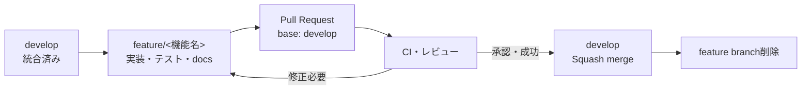
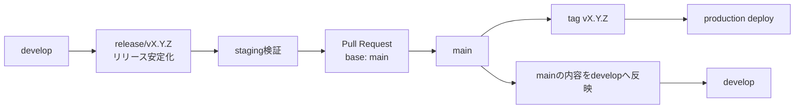
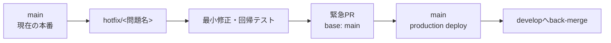
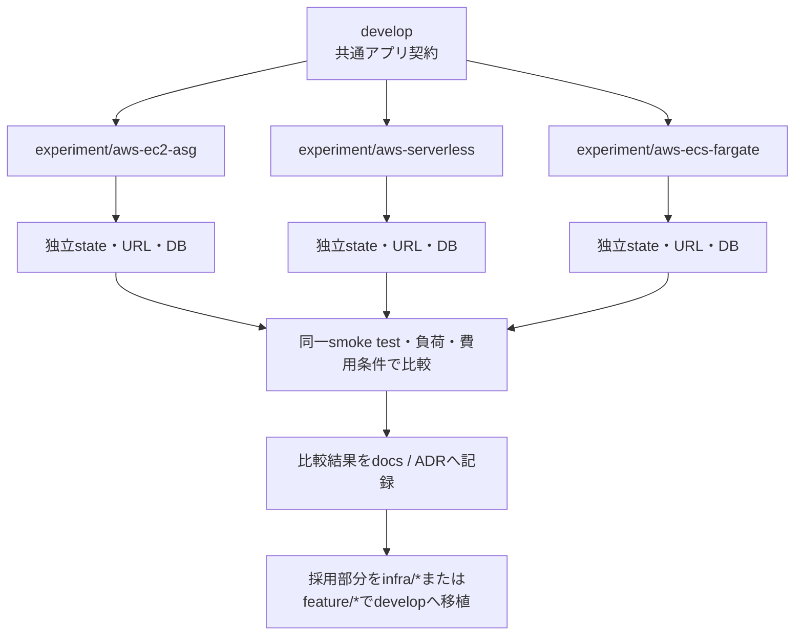

# Git ブランチ戦略

## 目次

1. [目的](#1-目的)
2. [基本方針](#2-基本方針)
3. [ブランチの種類](#3-ブランチの種類)
4. [通常の機能開発フロー](#4-通常の機能開発フロー)
5. [リリースフロー](#5-リリースフロー)
6. [本番障害のHotfixフロー](#6-本番障害のhotfixフロー)
7. [AWS構成比較のブランチ運用](#7-aws構成比較のブランチ運用)
8. [命名規則](#8-命名規則)
9. [Pull Requestとマージ規則](#9-pull-requestとマージ規則)
10. [CI/CDと環境の対応](#10-cicdと環境の対応)
11. [ブランチ保護](#11-ブランチ保護)
12. [運用例](#12-運用例)
13. [禁止事項](#13-禁止事項)
14. [導入時の確認事項](#14-導入時の確認事項)
15. [更新履歴](#15-更新履歴)

## 1. 目的

本書は、`devlab-board` におけるGitブランチの役割、作成元、マージ先、命名、リリースおよびAWS構成比較の運用を定義する。

次の状態を実現することを目的とする。

- `main` の内容と本番環境の差を最小化する。
- 機能開発を `feature/*` に分離し、安全に統合する。
- 開発中の変更と本番緊急修正を混在させない。
- EC2 Auto Scaling、Serverless、ECS Fargateの比較実験を、アプリケーション開発とTerraform stateから分離する。
- 人間とCodexのどちらが作業しても、ブランチ名から目的とライフサイクルを判断できるようにする。

## 2. 基本方針

本プロジェクトは、長期ブランチを `main` と `develop` の2本に限定する軽量Git Flowを採用する。

1. `main` は本番環境へ反映する唯一のブランチとする。
2. `develop` は次回リリースに向けた統合ブランチとする。
3. 通常の開発は `develop` から短命ブランチを作成し、Pull Requestで `develop` へ戻す。
4. `main` と `develop` への直接push、force-push、履歴改変を行わない。
5. 本番反映は `main` へのマージを起点とし、本番対象commitにはrelease tagを付ける。
6. ブランチは環境やTerraform stateそのものではない。AWS resourceとstateは `variant × environment` で明示的に分離する。
7. マージ済みの短命ブランチは、復旧や監査に必要な情報をPRへ残したうえで削除する。

## 3. ブランチの種類

| ブランチ | 寿命 | 作成元 | マージ先 | 用途 |
| --- | --- | --- | --- | --- |
| `main` | 長期 | - | - | 本番へ反映するリリース済みコード |
| `develop` | 長期 | `main`から初期作成 | `main` | 次回リリース候補を統合する |
| `feature/*` | 短期 | `develop` | `develop` | ユーザー向け機能、API、画面、DB変更 |
| `fix/*` | 短期 | `develop` | `develop` | 未リリース部分を含む通常の不具合修正 |
| `docs/*` | 短期 | `develop` | `develop` | ドキュメントだけの変更 |
| `refactor/*` | 短期 | `develop` | `develop` | 外部挙動を変えない構造改善 |
| `test/*` | 短期 | `develop` | `develop` | テスト追加・テスト基盤改善 |
| `chore/*` | 短期 | `develop` | `develop` | 依存更新、開発ツール、CI等の保守 |
| `infra/*` | 短期 | `develop` | `develop` | 採用済みまたは共有可能なIaC変更 |
| `release/*` | 短期 | `develop` | `main`、その後`develop`へ反映 | リリース前の安定化 |
| `hotfix/*` | 短期 | `main` | `main`、その後`develop`へ反映 | 本番障害・重大な脆弱性の緊急修正 |
| `experiment/aws-*` | 期限付き | `develop` | 原則直接マージしない | AWS構成比較、PoC、計測 |

`release/*` は、複数変更をまとめて検証する場合やリリース準備に時間が必要な場合だけ使う。小規模なリリースは、検証済みの `develop` から `main` へのPRで実施できる。

## 4. 通常の機能開発フロー



手順:

1. 最新の `develop` から `feature/<kebab-case>` を作る。
2. 一つのユーザー価値または一つの明確な技術目的に変更を絞る。
3. 実装、テスト、関連docsを同じブランチで更新する。
4. `develop` をbaseとするPull Requestを作成する。
5. CI、レビュー、必要な動作確認を完了する。
6. 原則Squash mergeし、featureブランチを削除する。

一つのfeatureブランチへ無関係な機能、複数のAWS variant、広範なリファクタリングを同時に含めない。

## 5. リリースフロー



### 5.1 staging環境へのデプロイ

- 常設の `staging` ブランチは作成しない。
- 通常リリースでstaging環境へデプロイするGit refは `release/*` とする。
- `develop` はdev環境までとし、staging環境へ直接デプロイしない。
- stagingでは、productionと同じbuild artifact、migration手順、設定境界、smoke test、rollback手順を確認する。
- staging検証中の修正は対象の `release/*` へcommitし、再検証する。新機能は追加しない。
- staging承認後、同じ検証済みcommitを `main` へマージする。マージ後にコード変更を加えた場合は、再度release gateを通す。
- `hotfix/*` は緊急フローとして、必要に応じて隔離した検証枠または手動承認付きのstaging検証を行えるが、常設 `staging` ブランチは作らない。

### 5.2 リリース規則

- `main` へのマージ前に、対象commitを固定してCIと必要なstaging確認を行う。
- リリース準備中は `release/*` へ新機能を追加せず、version、docs、設定、リリースを妨げる不具合だけを修正する。
- `main` へのマージ後、本番リリース対象commitへSemantic Versioning形式の `vX.Y.Z` tagを付ける。
- production deployは `main` のcommitまたはそのrelease tagだけを対象にする。
- `main` 上で行ったrelease調整を `develop` へ必ず反映し、差分を残さない。
- deploy失敗時は、修正commitを作るか、文書化したrollback手順で直前の正常releaseへ戻す。公開済み履歴を書き換えない。

### 5.3 Tag方針

Tagはブランチに付けるものではなく、リリース時点のcommitを不変の名前で特定するために使用する。

- 本番リリースごとに、`main` 上の対象commitへ `vMAJOR.MINOR.PATCH` tagを付ける。
- 初期開発中は `v0.1.0`、`v0.2.0` のような `v0.x.y` を使用できる。
- 後方互換のある機能追加はminor、互換性のある修正とhotfixはpatchを上げる。`v1.0.0` 以降の破壊的変更はmajorを上げる。
- release branch名と予定tagを対応させる。例: `release/v0.3.0` から `v0.3.0` を作る。
- tagはannotated tagを推奨し、version、対象commit、リリース概要を追跡できるようにする。
- 公開済みtagを別commitへ付け替えたり削除したりしない。修正が必要なら新しいpatch versionを発行する。
- `feature/*`、`develop`、通常の `experiment/aws-*` にはtagを付けない。検証対象はcommit SHAとPR／ADRで記録する。
- release candidateを外部共有または複数回配布する必要が生じた場合だけ、`v0.3.0-rc.1` のようなpre-release tagを使用する。現段階では必須としない。

## 6. 本番障害のHotfixフロー



- `hotfix/*` は現在の `main` から作成する。
- 対象は本番障害、データ破損、重大なセキュリティ問題等に限定する。
- 修正範囲を最小化し、通常の機能追加を含めない。
- `main` へ反映後、同じ修正を `develop` へmergeする。
- `develop` 側で競合する場合も、hotfixの意味を変えずに解消し、再検証する。

## 7. AWS構成比較のブランチ運用

### 7.1 二種類のインフラブランチ

| 種類 | 例 | 用途 | 終了条件 |
| --- | --- | --- | --- |
| 共有IaC変更 | `infra/ecs-health-check` | 採用済み構成や共通Terraformの改善 | PRで`develop`へmergeして削除 |
| 比較実験 | `experiment/aws-ecs-fargate` | 構成固有のPoC、性能・費用・運用比較 | 結論をdocs/ADRへ残して削除または明示的に延長 |

AWS比較の候補名:

```text
experiment/aws-ec2-asg
experiment/aws-serverless
experiment/aws-ecs-fargate
```

### 7.2 比較実験の流れ



### 7.3 AWS比較の規則

- `experiment/aws-*` は本番環境へ直接deployしない。
- 比較ブランチごとにTerraform state、resource名、tag、URL、DBを分離する。
- branch名だけをstate分離の安全装置にしない。Terraform backend keyとAWS account / environment / variantを明示する。
- 共通のアプリ機能、API contract、DB migrationは先に `feature/*` から `develop` へ統合し、比較ブランチだけに機能差分を抱えない。
- 実験中に `develop` が進んだ場合は、比較タイミングを決めて取り込み、比較対象commitを記録する。
- 複数variantを比較するときは、region、データ、期間、負荷、計測方法を揃える。
- 採用する実装は、必要部分を `infra/*` または `feature/*` に整理して `develop` へPRする。実験branch全体を無条件にmergeしない。
- 実験終了時にresourceをdestroyするか維持するかを記録し、不要なAWS費用を残さない。

## 8. 命名規則

形式:

```text
<type>/<short-kebab-case-description>
```

例:

```text
feature/finance-dashboard-overview
feature/finance-transaction-history
fix/finance-pagination-cursor
docs/git-branch-strategy
infra/ecs-fargate-health-check
release/v1.2.0
hotfix/session-cookie-expiration
experiment/aws-serverless
```

命名ルール:

- 英小文字、数字、ハイフンを使用する。
- ブランチ名だけで目的が推測できる具体的な名前にする。
- Issue番号を使う場合は `feature/123-finance-overview` のように説明も残す。
- 個人名だけ、`test`、`update`、`work` 等の曖昧な名前を避ける。
- 一つのブランチで複数目的を `and` で連結しない。必要なら分割する。

## 9. Pull Requestとマージ規則

### 9.1 PRのbase

| head | base |
| --- | --- |
| `feature/*`、`fix/*`、`docs/*`、`refactor/*`、`test/*`、`chore/*`、`infra/*` | `develop` |
| `release/*` | `main`。完了後に`main`を`develop`へ反映 |
| `hotfix/*` | `main`。完了後に`main`を`develop`へ反映 |
| `experiment/aws-*` | 原則PRによる直接mergeをしない。採用部分を別ブランチへ整理 |

### 9.2 PRの必須情報

- 目的とユーザー／運用への影響。
- 変更範囲と対象外。
- API、DB、認証、AWS、costへの影響。
- 実行したtest、build、Terraform check、手動確認。
- migration、deploy、rollback、destroyの手順または不要である理由。
- 関連Issue、要件、設計、ADRへのリンク。

### 9.3 マージ方式

- `feature/*` 等の短命ブランチから `develop` は、原則Squash mergeとする。
- `release/*`、`hotfix/*`、`main`、`develop` 間は、履歴上の境界が分かるmerge commitを許可する。
- merge commit、squash、rebaseをPRごとに無秩序に混在させない。
- CI失敗、未解決の重大レビュー指摘、必要な承認不足があるPRをmergeしない。

## 10. CI/CDと環境の対応

| Git ref | 主な処理 | Deploy先 |
| --- | --- | --- |
| Pull Request | lint、typecheck、test、build、Terraform fmt / validate、security check | 原則deployなし。必要時だけ期限付きpreview |
| `develop` | 統合test、build、smoke test | dev環境 |
| `release/*` | release candidate検証、migration確認 | staging環境 |
| `main` / `vX.Y.Z` | 全release gate、承認、deploy後smoke test | production |
| `experiment/aws-*` | variant固有test、plan、比較計測 | 独立した期限付き実験環境 |

- production deployにはGitHub Environment等の明示承認を設ける。
- `terraform apply` はブランチへのpushだけで無条件実行しない。
- deploy対象のcommit SHA、environment、AWS account、region、variant、実行者を記録する。
- DB migrationはapplication rolloutと責務を分け、失敗時にdeployを停止する。

## 11. ブランチ保護

`main`:

- 直接pushとforce-pushを禁止する。
- Pull Request、必須CI、レビュー承認を要求する。
- conversation resolutionを要求する。
- production deployは明示承認を要求する。
- tagの上書きと削除を制限する。

`develop`:

- 原則として直接pushとforce-pushを禁止する。
- Pull Requestと必須CIを要求する。
- 少なくとも変更リスクに応じたレビューを行う。

管理者権限による例外操作を常用しない。緊急時に例外を使った場合は、理由と事後確認をIssueまたはPRへ残す。

## 12. 運用例

### 12.1 Finance Dashboardの最初の画面

```text
develop
  -> feature/finance-dashboard-overview
  -> Pull Request to develop
  -> Squash merge
  -> branch delete
```

DB、API、React画面が一つのユーザー価値を構成する場合、同じ `feature/*` で縦に実装する。大きすぎる場合は、動作可能なSlice単位で `feature/finance-dashboard-entry`、`feature/finance-summary` 等へ分ける。

### 12.2 ECS Fargate比較

```text
develop
  -> experiment/aws-ecs-fargate
  -> isolated plan/apply and measurement
  -> ADR作成
  -> infra/ecs-fargate-baselineへ採用部分を整理
  -> Pull Request to develop
  -> experiment branchと不要resourceを削除
```

### 12.3 本番リリース

```text
develop
  -> release/v1.0.0
  -> staging verification
  -> Pull Request to main
  -> tag v1.0.0
  -> production deploy
  -> mainをdevelopへ反映
```

## 13. 禁止事項

- `main` で直接開発する。
- productionへ `develop`、`feature/*`、`experiment/*` から直接deployする。
- 一つのブランチに無関係な機能、整形、依存更新、インフラ変更を混在させる。
- 同じTerraform stateを複数のAWS比較ブランチから同時に操作する。
- merge済み履歴をforce-pushで書き換える。
- CIやレビューを避けるためだけにbranch typeを変える。
- 長期間放置したfeatureブランチを同期・再検証せずmergeする。
- secrets、Terraform state、plan artifact、実データをGitへcommitする。

## 14. 導入時の確認事項

この戦略をGitHub運用へ反映するとき、次を決定・設定する。

1. `main` と `develop` のbranch protection rule。
2. 必須status checkの具体名。
3. 通常PRと本番PRに必要な承認人数。
4. GitHub Environmentの `dev`、`staging`、`production` と承認者。
5. annotated tagとGitHub Release／release notesを自動作成するか。
6. AWS比較実験branchの標準TTLと月額上限。
7. preview環境を作るPRの条件。

## 15. 更新履歴

| 日付 | 内容 |
| --- | --- |
| 2026-08-11 | `main`を本番、`develop`を統合先とする軽量Git FlowとAWS比較ブランチ運用を初版策定 |
| 2026-08-11 | 常設staging branchを作らず `release/*` をstagingへデプロイする規則と、本番commitへのversion tag方針を追加 |
