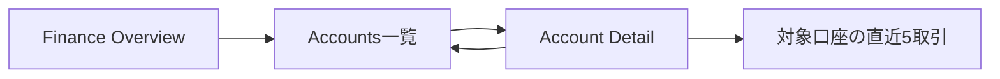

# Finance Accounts一覧・詳細実装

## 1. 目的

ログインユーザーが自分のFinance口座を一覧表示し、公開IDで口座詳細と直近5取引を確認できるSlice 2を実装する。

## 2. ユーザージャーニー

> ログインユーザーとして、自分の口座を一覧から選び、残高snapshotと最近の口座別取引を確認したい。これにより、Overviewの合計値から個別口座の内訳へ安全に移動できる。

## 3. 対象範囲

対象:

- `GET /api/finance/accounts`。
- `GET /api/finance/accounts/{accountId}`。
- `/finance-lab/accounts` と `/finance-lab/accounts/:accountId`。
- public IDとsession user IDを組み合わせた所有者境界。
- active・closed、mask、残高、基準日時の表示。
- Account Detail内の直近5取引。
- loading、empty、error、permission、not found、session expired。
- TanStack QueryによるFinance server stateとlogout／401時のcache破棄。

対象外:

- 金融機関・provider connectionのgrouping。
- 全取引一覧、filter、sort選択、cursor pagination。
- 口座の作成・更新・接続解除。
- synthetic fixtureの投入方法。

## 4. 設計判断

- 現行schemaに金融機関情報がないため、架空のinstitutionを追加せずフラットな口座一覧を返す。
- 詳細取引は固定5件とし、Slice 3の取引履歴APIを先回りしない。
- 取引順はSummaryと同じ確定日時優先とし、口座別expression indexを新しいmigrationで追加する。
- 完全な口座番号を保存せず、APIはDBの `mask` だけを返し、UIで視覚的なマスク記号を付ける。
- 金額は既存契約と同じdecimal stringを維持し、FrontendはBigIntのままlocale表示する。
- API由来stateが複数routeへ広がるため、このSliceでTanStack Queryを導入する。
- query keyはFinance境界へ集約し、logoutまたは401時にFinance prefixのqueryをcancel・removeする。

## 5. TDD計画

Backendはhandler、service、PostgreSQL integrationの順に失敗するtestを追加し、認証、所有者分離、404の同一化、金額精度、最大5件、安定順、index利用を固定する。

FrontendはAPI boundary、route、一覧・詳細の各UI状態、mask、金額精度、keyboard、direct URL、cache破棄を失敗するtestで固定してから実装する。

## 6. 検証結果

| 検証 | 結果 |
| --- | --- |
| Backend unit / handler / PostgreSQL integration | Dockerで `RUN_DB_TESTS=1 go test -count=1 ./...` 成功 |
| Backend static check | `go vet ./...` 成功、Finance package coverage 82.5% |
| Frontend test | 38 tests passed |
| Frontend coverage | statements / lines 99.26%、branches 91.04%、functions 94.59% |
| Frontend production build | 成功 |
| Production dependency audit | high以上0件 |
| Docker migration | version 1〜4の適用とchecksumを確認 |
| PostgreSQL query plan | account別expression indexを利用し、`Sort`なし |
| Browser | 一覧→詳細、active / closed、mask、大整数金額、取引、390px mobileを確認 |
| Browser console / layout | warning・error 0件、横overflowなし |

主な実装ファイル:

- `backend/internal/finance/account.go`
- `backend/internal/finance/account_repository.go`
- `backend/internal/app/finance_accounts_test.go`
- `backend/internal/platform/postgres/migrations/0004_finance_account_recent_index.sql`
- `frontend/src/features/finance/FinanceAccounts.tsx`
- `frontend/src/features/finance/FinanceAccountDetail.tsx`
- `frontend/src/features/finance/financeApi.ts`
- `frontend/src/lib/queryClient.ts`

TDDでは、route・type・service・query key・UIが未実装であることとmigration件数の不一致をREDで確認した後、最小実装、共通formatterとserver state境界の整理、全体testの順に進めた。

## 7. 要確認・ヒアリング項目

- 金融機関別表示はsandbox provider接続Sliceで `finance_connections` とともに扱う。
- 口座数がMVP想定を超える段階で一覧paginationの要否を再評価する。

## 8. 更新履歴

| 日付 | 内容 |
| --- | --- |
| 2026-08-11 | Slice 2の対象範囲、API、TDD計画を作成 |
| 2026-08-11 | Backend・Frontend実装、migration 0004、Docker・browser検証を完了 |
| 2026-08-11 | 独立レビューの小2件を修正し、全検証を再実行 |
