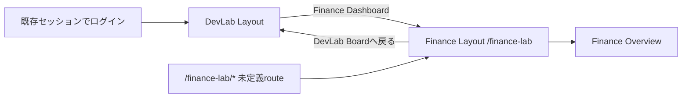

# Finance Dashboard 入口・専用レイアウト実装

## 1. 目的

認証済みユーザーがDevLab BoardのサイドメニューからFinance Dashboardへ移動し、Finance専用レイアウトを利用した後、DevLab Boardへ戻れる最小機能を実装する。

この機能は、後続の残高概要、口座、取引画面を配置するルーティングとレイアウトの境界を先に確定する。未定義の金額や口座を仮データで表示しない。

## 2. ユーザージャーニー

> ログインユーザーとして、DevLab BoardからFinance Dashboardを開き、金融機能専用のナビゲーションを使いたい。これにより、通常の開発ラボと金融機能を迷わず行き来できる。



## 3. 対象範囲

対象:

- DevLabサイドメニューへの `Finance Dashboard` 導線。
- `/finance-lab` route。
- DevLabサイドバーと同時表示しないFinance専用レイアウト。
- Finance Homeのactive表示。
- Accounts、Transactionsの将来導線をComing Soonとして表示。
- `DevLab Boardへ戻る` 導線。
- サイドバー開閉、mobile表示、keyboard focus。
- 未定義 `/finance-lab/*` から `/finance-lab` へのredirect。

対象外:

- Finance用API、DB table、migration。
- 残高、口座、取引のsynthetic data。
- Accounts、Transactionsの実画面。
- TanStack Query、Jotai等の状態管理追加。

## 4. 設計

### 4.1 Component境界

```text
App
├── 未認証: 既存Auth UI
└── 認証済みRoutes
    ├── DevLabLayout
    │   ├── OverviewPage
    │   └── UserAgentLabPage
    └── FinanceLayout
        └── FinanceOverview
```

- `App` は既存のsession取得と認証境界を維持する。
- `DevLabLayout` は既存サイドバーと `Outlet` を持つ。
- `FinanceLayout` は `features/finance` 内に置き、専用sidebarと `Outlet` を持つ。
- Finance配下のserver stateはまだ存在しないため、sidebar開閉だけをlocal stateとする。

### 4.2 Route契約

| URL | 結果 |
| --- | --- |
| `/` | DevLab Overview |
| `/user-agent-lab` | DevLab User-Agent Lab |
| `/finance-lab` | Finance Layout + Finance Overview |
| `/finance-lab/*` | `/finance-lab`へredirect |
| その他 | `/`へredirect |

### 4.3 UI状態

- 未認証: 既存の認証画面を表示し、Finance Layoutを表示しない。
- 認証済み: Finance専用sidebarとOverviewを表示する。
- sidebar closed: 本文を全幅表示し、開くbuttonを残す。
- Accounts / Transactions未実装: 操作可能なlinkにせずComing Soonと明示する。

## 5. Test設計

1. 認証済みユーザーがDevLabのlinkからFinance Overviewを開ける。
2. FinanceではDevLab sidebarが消え、Finance sidebarだけが表示される。
3. Homeがactiveとなり、戻るlinkをkeyboardで実行できる。
4. 未定義のFinance routeはFinance Overviewへ戻る。
5. Finance画面から既存sessionをlogoutできる。
6. 未認証のFinance直接アクセスでは認証画面を表示する。
7. Finance componentのcoverageを80%以上にする。

## 6. 検証結果

Docker Composeの `frontend` service上で次を確認した。

| 検証 | 結果 |
| --- | --- |
| `yarn test` | 5 tests passed |
| `yarn test:coverage` | Finance対象2 filesでstatements / branches / functions / linesがすべて100% |
| `yarn build` | TypeScript compile、Vite production build成功 |
| Browser確認 | DevLabからFinanceへの遷移、専用layout、sidebar開閉、DevLabへの復帰を確認 |
| Browser console | error 0件 |
| 1280px viewport | document幅とviewport幅が一致し、横overflowなし |

実装ファイル:

- `frontend/src/features/finance/FinanceLayout.tsx`
- `frontend/src/features/finance/FinanceOverview.tsx`
- `frontend/src/App.tsx`
- `frontend/src/style.css`
- `frontend/src/App.test.tsx`
- `frontend/vitest.config.ts`

## 7. 更新履歴

| 日付 | 内容 |
| --- | --- |
| 2026-08-11 | UC-01とFR-NAV-001〜006を対象に初版設計を作成 |
| 2026-08-11 | 実装、Docker test・coverage・build、browser確認を完了 |
