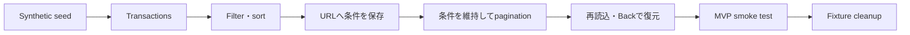

# Finance Transactions filter・sortと読み取りMVP完成実装

## 1. 目的

Slice 3Bのfilter・sortを完成させ、決定的synthetic dataと共通smoke testにより、OverviewからTransactionsまでの読み取りMVPをローカルで繰り返し検証できる状態にする。

## 2. ユーザージャーニー

## 3. 対象範囲

- 口座、UTC期間、カテゴリー、入出金方向、状態の単一選択filter。
- 新しい順・古い順のsort。
- filter、sort、cursorのURL同期。
- DB category masterを取得する認証必須API。
- filter条件とcursorの結合検証。
- local / testだけで実行できるsynthetic seed / cleanup。
- 認証と主要な読み取りAPIを確認する共通smoke command。
- MVP受け入れ条件matrixとlocal runbook。

対象外:

- keyword検索、金額範囲、複数選択。
- ユーザーtimezone、カテゴリー編集。
- provider同期、snapshot pagination。
- CSV import / export、実金融データ。

## 4. 設計判断

- URL queryを適用済みfilter・sort・cursorの唯一の正とする。フォームの未適用draft stateは作らず、native control変更時にURLへ反映する。
- filter・sort変更時はcursorだけを削除し、次ページと先頭へ戻る操作ではfilter・sortを維持する。
- 前ページdataの維持はfilter・sortが同一でcursorだけ変わる場合に限定する。
- 日付はSlice 4までUTC暦日とし、`date_to` は内部で翌日未満へ変換する。
- SQL値はすべてparameter化し、動的な条件・sort・比較演算子は検証済み値に対応する固定断片だけを使う。
- schemaは変更せず、既存user/account recent indexを再利用する。代表queryの `EXPLAIN` で不足が確認された場合だけ後続migrationを追加する。
- synthetic seedは共有userやpasswordを変更せず、指定した既存ユーザーのfixture専用public IDだけをapply / cleanする。
- smokeのcredentialは環境変数から受け取り、引数、標準出力、errorへ出さない。

## 5. TDD計画

Backend:

- filter、date、sort、duplicate・unknown queryのvalidation。
- 全filterの単独・組み合わせ、両sort、cursor不一致、所有者分離。
- category optionsの順序、空配列、error。
- seedの環境制限、決定性、再実行、cleanup、別ユーザー分離。
- smoke response検証とcredential非表示。

Frontend:

- 全条件付き直接URLとAPI request。
- filter・sort変更時のcursor削除、pagination時の条件維持。
- Browser Back、全解除、filtered empty、不正query復旧。
- account/category options、keyboard、mobile、旧条件data非表示。

## 6. 検証結果

- Docker Compose上でPostgreSQL統合を含む `go test -count=1 ./...` と `go vet ./...` が成功した。
- Backend coverageは `finance` 86.5%、`financeseed` 86.8%、`financesmoke` 83.1%だった。
- Frontendは63 testが成功し、全体coverageはstatement / line 99.61%、branch 94.18%、function 88.46%だった。
- Frontend production buildとdependency auditが成功し、既知vulnerabilityは0件だった。
- newest、oldest、期間、口座filterの `EXPLAIN` で既存indexを利用でき、追加Sortを必要としないことを確認した。schemaとmigrationの追加は不要と判断した。
- 実コンテナでprimary / secondaryそれぞれへsynthetic fixture 2口座・40取引を投入し、所有者境界を含む共通HTTP smokeを完走後、両fixtureをcleanupした。
- 最初のsmokeではViteがDocker service名 `frontend` を拒否して403となった。`allowedHosts`をそのservice名だけに限定して追加し、再実行で成功した。
- Browserで6条件、oldest、URL再読込、25件から15件へのpagination、Back / Forwardを確認した。
- 390x844ではfilterが1列となり、document全体の横overflowはなく、取引table領域だけが横scrollした。console warning / errorは0件だった。
- 独立レビューの重大度「中」4件を修正した。raw URLのunknown・duplicate・empty query拒否、smoke responseのfilter・sort・page意味検証、remote HTTP API拒否、2ユーザーownership確認を追加した。

## 7. Workflow判断

新しいskillやroleは追加しない。検証経路を増やしすぎないため、既存のverify playbookへFinance MVPのseed → smoke → clean入口だけを追記した。

## 8. 更新履歴

| 日付 | 内容 |
| --- | --- |
| 2026-08-11 | Slice 3B、synthetic seed、MVP smokeの設計とTDD計画を作成 |
| 2026-08-11 | Slice 3B、deterministic seed、共通smoke、Docker・browser検証を完了 |
