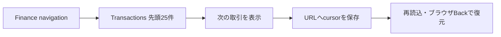

# Finance Transactions基本版実装

## 1. 目的

ログインユーザーが自分の全取引を新しい順で確認し、cursor paginationで次ページへ進み、URLの再読込・ブラウザ履歴でも現在ページを維持できるSlice 3Aを実装する。

## 2. ユーザージャーニー

## 3. 対象範囲

対象:

- `GET /api/finance/transactions`。
- `/finance-lab/transactions`。
- 現在ユーザー所有の全取引を新しい順で表示。
- 既定25件、最大100件のcursor pagination。
- `cursor` のURL query同期。
- loading、empty、error、permission、invalid cursor、session expired。
- nullable merchant/category、pending/posted/reversed、debit/creditの文字表示。
- keyboard、desktop、390px mobile。

対象外:

- 口座、期間、カテゴリー、入出金方向、状態filter。
- ユーザー選択sortとkeyword検索。
- CSV export、取引詳細、取引編集。
- provider同期、provider event重複排除。
- synthetic fixtureの恒久的な投入方法。

## 4. 設計判断

- 小さい縦切りを優先し、Mustの全取引・表示項目・paginationを3A、Should/Couldのfilter・sort・検索を3Bへ分ける。
- frontendのpagination stateはReact RouterのURL queryを正とし、transaction dataはTanStack Queryだけで保持する。
- cursorは公開transaction UUIDから生成し、内部bigint IDをAPIへ出さない。
- cursor位置はrepositoryがsession user条件付きで解決し、他ユーザー・不存在・不正cursorを同じ400へ変換する。
- query順は既存の `finance_transactions_user_recent_idx` と一致させる。
- table、column、constraintを変更しないため新migrationは追加しない。DBMLとDB設計書には、既存indexを取引履歴でも使うことを同期し、実queryの `EXPLAIN` で利用を確認する。
- logoutまたは401では既存Finance prefixのquery cancel・cache removeを再利用する。
- 現行workflowはTDD、DBML同期、レビュー、日本語コミット分類を既に定義しているため、新規workflow ruleは追加しない。

## 5. TDD計画

Backend RED:

- default 25、limit境界、cursor形式をdomain testで固定する。
- handlerの401、session user ID、空配列、decimal string、400、500を固定する。
- repository integrationで所有者分離、同一日時tie-break、2ページ間の重複・欠落なし、invalid/unowned cursorを固定する。
- `EXPLAIN`で既存user recent index利用と不要なSortなしを確認する。

Frontend RED:

- Transactions route、active navigation、直接URLを固定する。
- loading、success、empty、401、403、400、500/networkを固定する。
- 全表示項目、大整数金額、nullable merchant/category、status/direction文字表示を固定する。
- Nextでcursor URLをpushし、再読込・browser Backでqueryを復元する。
- semantic table、pagination navigation、keyboard操作を固定する。

## 6. 検証結果

| 対象 | 結果 |
| --- | --- |
| Backend | Docker PostgreSQL統合テストを含む `go test -count=1 ./...` 成功 |
| Backend静的検査 | `go vet ./...` 成功 |
| Finance coverage | PostgreSQL統合テスト込みでstatement 84.2%。TransactionService 95.2%、TransactionRepository 82.4% |
| Frontend | 6 files / 52 tests成功。statement・line 98.68%、branch 92.39%、function 90.74% |
| Frontend build | TypeScript buildとVite production build成功 |
| Dependency audit | production dependency 0 vulnerabilities |
| Query plan | `finance_transactions_user_recent_idx` を利用し、不要な `Sort` なし |
| Browser desktop | 25件表示、次ページ2件、cursor付きURL再読込、ブラウザBackによる先頭ページ復元を確認 |
| Browser mobile | 390x844でdocument横overflowなし。取引tableだけを横スクロール可能 |
| Browser console | warning・errorなし |
| Migration | 追加なし。既存migration 1〜4で全テスト成功 |
| Independent review | 重大度「中」1件を修正済み。malformed raw queryを400へ正規化する回帰テストを追加 |

ブラウザ検証には3ユーザーへ各27件のsynthetic取引を一時投入し、検証後に対象口座3件とcascadeされた取引81件を削除した。実在する金融情報は使用していない。

## 7. 要確認・後続項目

- Slice 3Bで主要filter、sort、URL同期を追加する。
- `posted_at` がpagination中に更新された場合の順序移動は、provider同期Sliceでsnapshotまたは再取得方針を再評価する。

## 8. 更新履歴

| 日付 | 内容 |
| --- | --- |
| 2026-08-11 | Slice 3Aの対象範囲、API、cursor、TDD計画を作成 |
| 2026-08-11 | API・画面を実装し、Docker、query plan、desktop・390px browser検証結果を追記 |
