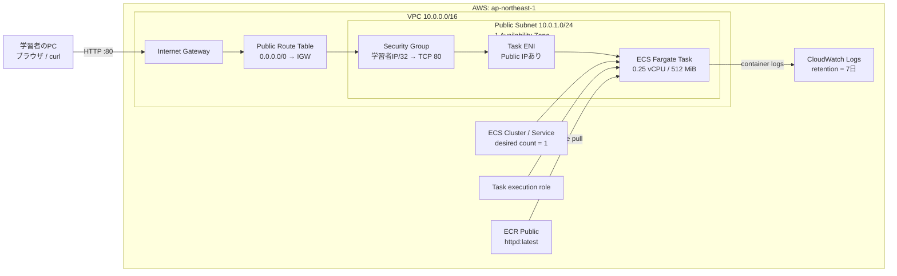

# AWSコンソールではじめる ECS Fargate 最小構成ハンズオン

## 目次

1. [このハンズオンのゴール](#1-このハンズオンのゴール)
2. [Terraform版との関係](#2-terraform版との関係)
3. [今回作る構成](#3-今回作る構成)
4. [費用とセキュリティの注意](#4-費用とセキュリティの注意)
5. [事前準備](#5-事前準備)
6. [完成時の設定値](#6-完成時の設定値)
7. [VPCを作成する](#7-vpcを作成する)
8. [Internet Gatewayを作成する](#8-internet-gatewayを作成する)
9. [Public Subnetを作成する](#9-public-subnetを作成する)
10. [Route Tableを作成する](#10-route-tableを作成する)
11. [Security Groupを作成する](#11-security-groupを作成する)
12. [CloudWatch LogsのLog Groupを作成する](#12-cloudwatch-logsのlog-groupを作成する)
13. [ECS task execution roleを作成する](#13-ecs-task-execution-roleを作成する)
14. [ECS Clusterを作成する](#14-ecs-clusterを作成する)
15. [Task Definitionを作成する](#15-task-definitionを作成する)
16. [ECS Serviceを作成する](#16-ecs-serviceを作成する)
17. [Apacheへアクセスする](#17-apacheへアクセスする)
18. [AWSコンソールで構成を観察する](#18-awsコンソールで構成を観察する)
19. [Terraformコードと対応させる](#19-terraformコードと対応させる)
20. [AWSリソースを削除する](#20-awsリソースを削除する)
21. [トラブルシューティング](#21-トラブルシューティング)
22. [次にTerraform版へ進む](#22-次にterraform版へ進む)
23. [公式リファレンス](#23-公式リファレンス)
24. [更新履歴](#24-更新履歴)
25. [要確認・ヒアリング項目](#25-要確認ヒアリング項目)

## 1. このハンズオンのゴール

このハンズオンでは、AWSマネジメントコンソールを使って、Webコンテナを1個動かすための最小構成を手作業で構築する。

作成する構成と設定値は、既存の[`ecs-fargate-minimum-handson.md`](./ecs-fargate-minimum-handson.md)に記載されたTerraform版と揃える。

完了時には、次の関係をAWSコンソール上で説明できる状態を目指す。

- VPC、Subnet、Route Table、Internet Gatewayがどのようにつながるか
- Security Groupがどこに適用されるか
- ECS Cluster、Task Definition、Task、Serviceの違い
- ECS task execution roleが何のためにあるか
- Fargate TaskにENIとPublic IPがどのように割り当てられるか
- コンテナの標準出力がCloudWatch Logsへ届く流れ
- コンソール操作がTerraformのどのresourceに対応するか
- 作成したリソースを依存関係の逆順で削除する方法

このハンズオンでは`devlab-board`本体はまだデプロイしない。AWS公式手順でも使用されているApache HTTP Server imageを動かし、まずECS Fargateの土台に集中する。

## 2. Terraform版との関係

おすすめの学習順は次のとおり。

1. この資料を使い、AWSコンソールで構成を作る
2. 各サービスの画面を行き来し、リソース同士の関係を観察する
3. この資料の削除手順で、作成したリソースをすべて削除する
4. Terraform版のハンズオンで同じ構成をもう一度作る
5. Terraformコードと、先ほど操作した画面を対応させる

### 2.1 なぜ一度削除してからTerraformで作るのか

AWSコンソールで作ったリソースは、Terraformのstateには登録されていない。

その状態で同じ名前のTerraformコードを`apply`すると、Terraformは既存リソースを管理対象とは認識せず、新しく作ろうとする。結果として、名前の重複などで失敗する可能性がある。

既存リソースを`terraform import`する方法もあるが、初回ハンズオンでは扱う内容が増えすぎる。そのため、ここでは次の流れに分ける。

```text
AWSコンソールで作成
        ↓
構成を観察
        ↓
AWSコンソールで削除
        ↓
Terraformで同じ構成を再作成
```

### 2.2 「同じ構成」の範囲

次をTerraform版と同じにする。

- Region
- VPCとSubnetのCIDR
- Resource name
- Network経路
- Security Group rule
- IAM policy
- ECS TaskのCPU、memory、OS、architecture
- Container image、port、log設定
- ECS Serviceのdesired countとnetwork設定

ただし、管理用metadataには次の意図的な差がある。

| 作成方法 | `ManagedBy` |
| --- | --- |
| AWSコンソール版 | `AWSConsole` |
| Terraform版 | `Terraform` |

コンソールで作ったリソースへ`ManagedBy=Terraform`を付けると、実態と異なるためである。

また、TerraformのAWS providerは、Security Group ruleにも`default_tags`を適用する。AWSコンソールのSecurity Group作成画面ではrule単位のtagを同時に入力できない場合があるため、この資料ではruleの通信設定とdescriptionを一致させ、rule tagは必須操作にしない。

これらは管理情報の差であり、networkやECSの動作構成の差ではない。

また、Terraform版で利用するAvailability Zoneは「利用可能なAZ一覧の先頭」で決まる。コンソール版でも画面に表示された利用可能なAZ一覧の先頭を選び、その値を作業記録へ残す。後でTerraformの`plan`結果とも照合する。

## 3. 今回作る構成

編集可能な構成図は[`ecs-fargate-minimum-handson-architecture.drawio`](./ecs-fargate-minimum-handson-architecture.drawio)を参照する。



### 3.1 作るもの

| 分類 | 作成するもの |
| --- | --- |
| Network | VPC、Internet Gateway、Public Subnet、Route Table |
| Security | Task用Security Group |
| IAM | ECS task execution role |
| Observability | CloudWatch Logs Log Group |
| Container | ECS Cluster、Task Definition、Service |

### 3.2 作らないもの

- Application Load Balancer
- NAT Gateway
- Private Subnet
- 独自ECR repository
- RDS / ElastiCache
- Route 53 / ACM / HTTPS
- Auto Scaling
- ECS Exec
- Service Connect
- Container Insightsの追加設定（ECS account settingの既定を継承）

Fargate TaskをPublic Subnetへ置き、Public IPへ直接HTTP接続する。構成要素が少なく、通信経路を追いやすい一方、本番向けの構成ではない。

## 4. 費用とセキュリティの注意

### 4.1 費用

このハンズオンは無料とは限らない。少なくとも次の料金が発生し得る。

- FargateのvCPU / memory利用時間
- Fargate Taskへ割り当てるPublic IPv4 address
- CloudWatch Logsの取り込みと保存
- データ転送

ALBとNAT Gatewayは作らないため、それらの時間課金は発生しない。

料金と無料利用枠は変更される。開始前に公式料金ページを確認し、作業を中断するときも原則として「20. AWSリソースを削除する」まで進める。

AWS Budgetsの通知は、利用を強制停止する仕組みではない。削除手順の代わりにはならない。

### 4.2 セキュリティ

- AWS root userでは操作しない
- 個人の学習用account、または管理者が許可したsandbox accountを使う
- 普段使う本番accountへ安易に`AdministratorAccess`を追加しない
- 画面右上のaccountとRegionを、作成前と削除前に確認する
- TCP 80は現在の自分のPublic IPv4 `/32`だけ許可する
- `0.0.0.0/0`や`::/0`からのinboundを設定しない
- SSH、RDP、port 8080など、使わないportを開けない
- containerへcredentialsやsecretを渡さない
- HTTPで直接公開するため、実データや個人情報を扱わない
- AWS account ID、resource ID、Public IPを公開記事のスクリーンショットへ残さない

## 5. 事前準備

### 5.1 必要なもの

- AWS Management Consoleへサインインできる学習用account / role
- `ap-northeast-1`で次を操作できる権限
  - VPC、Subnet、Route Table、Internet Gateway、Security Group、ENI
  - ECS Cluster、Task Definition、Service、Task
  - IAM roleの作成、policy attachment、`iam:PassRole`
  - CloudWatch Logs Log Group
- 自分のPublic IPv4を確認できる環境
- 動作確認用のブラウザまたは`curl`

権限不足になった場合は、エラーに表示されたactionを確認し、学習用roleの管理者へ必要な権限だけを依頼する。credentialsを共有してはいけない。

### 5.2 AccountとRegionを確認する

AWSコンソール右上で次を確認する。

| Item | Expected |
| --- | --- |
| Account | 学習に使う予定のaccount |
| Role | root userではない学習用role |
| Region | `Asia Pacific (Tokyo) ap-northeast-1` |

別のaccountやRegionだった場合は、構築を始めない。

### 5.3 自分のPublic IPv4を確認する

ブラウザで信頼できるIP確認サービスを利用するか、次を実行する。

```bash
curl --fail --silent https://checkip.amazonaws.com
```

表示されたIPv4の末尾に`/32`を付け、`MY_PUBLIC_IP/32`として記録する。

例:

```text
198.51.100.24/32
```

この例のIPをそのまま設定してはいけない。VPN、会社proxy、テザリングを切り替えるとPublic IPが変わることがある。

### 5.4 同名リソースがないことを確認する

各サービスの検索欄で`devlab-board-handson`を検索する。

既に同名リソースがある場合は、それが誰の管理物か確認する。内容が分からないリソースを削除したり、上書きしたりしない。

Terraform版を実行中なら、先にTerraform版の手順で`terraform destroy`を完了する。

### 5.5 作業記録を用意する

作成後、次の表へ実値を記録する。削除時の照合にも使う。

| Resource | Name | ID / Value |
| --- | --- | --- |
| AWS Account | - | |
| Signed-in role | - | |
| Region | - | `ap-northeast-1` |
| Availability Zone | - | 利用可能なAZ一覧の先頭 |
| VPC | `devlab-board-handson-vpc` | |
| Internet Gateway | `devlab-board-handson-igw` | |
| Public Subnet | `devlab-board-handson-public-subnet` | |
| Public Route Table | `devlab-board-handson-public-rt` | |
| Task Security Group | `devlab-board-handson-task-sg` | |
| Log Group | `/ecs/devlab-board-handson` | |
| Task execution role | `devlab-board-handson-task-execution-role` | |
| ECS Cluster | `devlab-board-handson-cluster` | |
| Task Definition | `devlab-board-handson-task` | |
| ECS Service | `devlab-board-handson-service` | |
| Running Task | AWSが自動生成 | |
| Task ENI | AWSが自動生成 | |
| Task Public IP | Task置換時に変わる | |

## 6. 完成時の設定値

操作中に迷ったら、この表へ戻る。

| Resource | Setting | Value |
| --- | --- | --- |
| Region | Region | `ap-northeast-1` |
| VPC | Name | `devlab-board-handson-vpc` |
| VPC | IPv4 CIDR | `10.0.0.0/16` |
| VPC | DNS resolution / hostnames | 有効 |
| Subnet | Name | `devlab-board-handson-public-subnet` |
| Subnet | IPv4 CIDR | `10.0.1.0/24` |
| Subnet | AZ | 利用可能なAZ一覧の先頭 |
| Subnet | Auto-assign public IPv4 | 有効 |
| Internet Gateway | Name | `devlab-board-handson-igw` |
| Route Table | Name | `devlab-board-handson-public-rt` |
| Route | Destination / Target | `0.0.0.0/0` / 作成したIGW |
| Security Group | Name | `devlab-board-handson-task-sg` |
| Inbound | HTTP | TCP 80、`MY_PUBLIC_IP/32` |
| Outbound | All traffic | `0.0.0.0/0` |
| Log Group | Name | `/ecs/devlab-board-handson` |
| Log Group | Retention | 7日 |
| IAM role | Name | `devlab-board-handson-task-execution-role` |
| IAM role | Trusted service | ECS Tasks |
| IAM role | Policy | `AmazonECSTaskExecutionRolePolicy` |
| ECS Cluster | Name | `devlab-board-handson-cluster` |
| Task Definition | Family | `devlab-board-handson-task` |
| Task Definition | Launch type | Fargate |
| Task Definition | OS / Architecture | Linux / X86_64 |
| Task Definition | Network mode | `awsvpc` |
| Task Definition | CPU / Memory | 0.25 vCPU / 0.5 GB |
| Container | Name | `app` |
| Container | Image | `public.ecr.aws/docker/library/httpd:latest` |
| Container | Port | TCP 80 / host 80 |
| Logs | Driver / prefix | `awslogs` / `app` |
| ECS Service | Name | `devlab-board-handson-service` |
| ECS Service | Launch type | Fargate |
| ECS Service | Desired tasks | 1 |
| ECS Service | Public IP | 有効 |
| ECS Service | Load Balancer | なし |

### 6.1 共通tag

tagを入力できる主要リソースには次を付ける。

| Key | Value |
| --- | --- |
| `Project` | `devlab-board` |
| `Environment` | `handson` |
| `ManagedBy` | `AWSConsole` |
| `Purpose` | `ECS Fargate hands-on` |

`Name` tagが必要なリソースには、各手順で示すresource nameも設定する。

## 7. VPCを作成する

### 7.1 VPCとは

VPCは、AWS上に作る仮想networkの境界である。Subnet、Route Table、Security Groupなどは、このVPCに所属する。

### 7.2 コンソール操作

1. AWSコンソールで`VPC`を開く
2. 左メニューから`Your VPCs`を選ぶ
3. `Create VPC`を押す
4. `Resources to create`で`VPC only`を選ぶ
5. 次を設定する

| Item | Value |
| --- | --- |
| Name tag | `devlab-board-handson-vpc` |
| IPv4 CIDR manual input | `10.0.0.0/16` |
| IPv6 CIDR block | No IPv6 CIDR block |
| Tenancy | Default |

6. 共通tagを追加する
7. `Create VPC`を押す
8. 作業記録へVPC IDを記入する

`VPC and more`は選ばない。SubnetやNAT Gatewayなどが追加作成され、Terraform版と同じ最小構成ではなくなるためである。

### 7.3 DNS設定を確認する

1. 作成したVPCを選ぶ
2. `Actions`から`Edit VPC settings`を開く
3. `DNS resolution`が有効であることを確認する
4. `DNS hostnames`を有効にする
5. 変更した場合は保存する

### 7.4 チェックポイント

- IPv4 CIDRが`10.0.0.0/16`
- IPv6 CIDRを追加していない
- DNS resolutionとDNS hostnamesが有効
- Default VPCを編集していない

Terraformでは`aws_vpc.main`に対応する。

VPCを1つ作ると、Main Route Table、default Security Group、default Network ACLもAWSによって自動作成される。Terraform版でVPCを作った場合も同様であり、今回手動作成するCustom Route TableやTask用Security Groupとは区別する。

## 8. Internet Gatewayを作成する

### 8.1 Internet Gatewayとは

Internet Gatewayは、VPCとインターネットをつなぐ入口である。作成するだけでは通信できず、VPCへのattachとRoute Tableの設定が必要になる。

### 8.2 コンソール操作

1. VPCコンソールの`Internet gateways`を開く
2. `Create internet gateway`を押す
3. Name tagへ`devlab-board-handson-igw`を入力する
4. 共通tagを追加する
5. `Create internet gateway`を押す
6. 作成後、`Actions`から`Attach to a VPC`を選ぶ
7. `devlab-board-handson-vpc`を選ぶ
8. `Attach internet gateway`を押す
9. 作業記録へInternet Gateway IDを記入する

### 8.3 チェックポイント

- Stateが`Attached`
- Attach先が`devlab-board-handson-vpc`
- Default VPCへattachしていない

Terraformでは`aws_internet_gateway.main`に対応する。

## 9. Public Subnetを作成する

### 9.1 Subnetとは

Subnetは、VPCのIP address範囲を分割した配置先である。

Subnetを作っただけではPublic Subnetにはならない。Internet Gatewayへのrouteを持つRoute Tableと関連付けることで、Public Subnetになる。

### 9.2 コンソール操作

1. VPCコンソールの`Subnets`を開く
2. `Create subnet`を押す
3. VPC IDで`devlab-board-handson-vpc`を選ぶ
4. 次を設定する

| Item | Value |
| --- | --- |
| Subnet name | `devlab-board-handson-public-subnet` |
| Availability Zone | 表示された利用可能なAZ一覧の先頭を選択 |
| IPv4 VPC CIDR block | `10.0.0.0/16` |
| IPv4 subnet CIDR block | `10.0.1.0/24` |

5. 共通tagを追加する
6. `Create subnet`を押す
7. 選択したAvailability ZoneとSubnet IDを作業記録へ記入する

### 9.3 Public IPv4の自動割り当て

1. 作成したSubnetを選ぶ
2. `Actions`から`Edit subnet settings`を開く
3. `Enable auto-assign public IPv4 address`を有効にする
4. 保存する

Subnet側の自動割り当てと、後で設定するECS Serviceの`Assign public IP`は別の設定である。Terraform版と揃えるため両方を有効にする。

### 9.4 チェックポイント

- VPCが`devlab-board-handson-vpc`
- IPv4 CIDRが`10.0.1.0/24`
- Availability Zoneが1つだけ
- Auto-assign public IPv4が`Yes`

Terraformでは`aws_subnet.public`に対応する。

## 10. Route Tableを作成する

### 10.1 Route Tableとは

Route Tableは、Subnetから出る通信をどこへ送るか決める。

今回の`0.0.0.0/0 → Internet Gateway`は、「VPC内部向け以外のIPv4通信をInternet Gatewayへ送る」という意味になる。

### 10.2 Route Tableを作成する

1. VPCコンソールの`Route tables`を開く
2. `Create route table`を押す
3. 次を設定する

| Item | Value |
| --- | --- |
| Name | `devlab-board-handson-public-rt` |
| VPC | `devlab-board-handson-vpc` |

4. 共通tagを追加する
5. `Create route table`を押す
6. 作業記録へRoute Table IDを記入する

### 10.3 Internet Gatewayへのrouteを追加する

1. 作成したRoute Tableを選ぶ
2. `Routes`タブを開く
3. `Edit routes`を押す
4. `Add route`を押す
5. 次を設定する

| Destination | Target |
| --- | --- |
| `0.0.0.0/0` | Internet Gateway → `devlab-board-handson-igw` |

6. `Save changes`を押す

`10.0.0.0/16 → local`はVPC内部通信用として自動的に存在する。削除しない。

### 10.4 Subnetへ関連付ける

1. 同じRoute Tableの`Subnet associations`タブを開く
2. `Edit subnet associations`を押す
3. `devlab-board-handson-public-subnet`だけを選ぶ
4. 保存する

### 10.5 チェックポイント

- Routeが`10.0.0.0/16 → local`
- Routeが`0.0.0.0/0 → devlab-board-handson-igw`
- Subnet associationsに作成したPublic Subnetが1つだけ表示される
- Main Route Tableを誤って編集していない

Terraformでは`aws_route_table.public`と`aws_route_table_association.public`に対応する。

## 11. Security Groupを作成する

### 11.1 Security Groupとは

Security Groupは、リソースへ到達できる通信と、リソースから出ていける通信を制御するstateful firewallである。

今回はFargate TaskのENIへ適用し、学習者のIPからTCP 80への通信だけを受け入れる。

### 11.2 コンソール操作

1. VPCコンソールの`Security groups`を開く
2. `Create security group`を押す
3. 次を設定する

| Item | Value |
| --- | --- |
| Security group name | `devlab-board-handson-task-sg` |
| Description | `Allow HTTP from the learner public IP` |
| VPC | `devlab-board-handson-vpc` |

4. Inbound rulesへ次の1件だけを追加する

| Type | Protocol | Port range | Source | Description |
| --- | --- | --- | --- | --- |
| HTTP | TCP | 80 | 現在の自分のPublic IPv4 `/32` | `HTTP from learner public IP` |

5. Outbound rulesは次の1件にする

| Type | Protocol | Port range | Destination | Description |
| --- | --- | --- | --- | --- |
| All traffic | All | All | `0.0.0.0/0` | `Allow image pull and AWS API access` |

6. 共通tagを追加する
7. `Create security group`を押す
8. 作業記録へSecurity Group IDを記入する

`My IP`を選んだ場合も、sourceが`x.x.x.x/32`になっていることを目視する。

### 11.3 なぜoutboundを許可するのか

Fargate Taskは起動時にECR Publicからimageを取得し、起動後はCloudWatch Logsへlogを送る。その通信経路を確保するため、今回の最小構成ではoutboundを許可する。

### 11.4 チェックポイント

- VPCが作成したVPC
- inboundはTCP 80の1件だけ
- sourceは自分のPublic IPv4 `/32`
- `0.0.0.0/0`や`::/0`からのinboundがない
- SSHやRDPのinboundがない
- outboundはAll trafficのIPv4 1件

Terraformでは次に対応する。

- `aws_security_group.task`
- `aws_vpc_security_group_ingress_rule.http`
- `aws_vpc_security_group_egress_rule.all`

## 12. CloudWatch LogsのLog Groupを作成する

### 12.1 Log Groupとは

CloudWatch Logsでは、同じ保存期間や権限を持つLog StreamをLog Groupへまとめる。

今回はLog Groupを先に作り、Task Definitionから既存のLog Groupを参照する。ECSの画面に任せて別名のLog Groupを自動作成しない。

### 12.2 コンソール操作

1. AWSコンソールで`CloudWatch`を開く
2. `Logs`、`Log groups`を開く
3. `Create log group`を押す
4. Log group nameへ`/ecs/devlab-board-handson`を入力する
5. 作成する
6. 一覧のRetention列から保存期間を編集する
7. Retentionを`7 days`に変更する
8. Log Groupへ共通tagを追加する

### 12.3 チェックポイント

- Log Group名が`/ecs/devlab-board-handson`
- Retentionが`7 days`
- `Never expire`のままになっていない
- Log Streamはまだ存在しなくても問題ない

Terraformでは`aws_cloudwatch_log_group.app`に対応する。

## 13. ECS task execution roleを作成する

### 13.1 task execution roleとは

task execution roleは、ECS/Fargateの実行基盤が次を行うためのroleである。

- container imageを取得する
- CloudWatch Logsへcontainer logを送る

container内のアプリケーションがAWS APIを呼ぶためのtask roleとは別物である。今回はアプリがAWS APIを呼ばないため、task roleは作らない。

### 13.2 コンソール操作

1. AWSコンソールで`IAM`を開く
2. `Roles`を選ぶ
3. `Create role`を押す
4. `Trusted entity type`で`AWS service`を選ぶ
5. Service or use caseで`Elastic Container Service`を選ぶ
6. Use caseで`Elastic Container Service Task`を選ぶ
7. 次へ進む
8. Permission policyで`AmazonECSTaskExecutionRolePolicy`を選ぶ
9. 次へ進む
10. Role nameへ`devlab-board-handson-task-execution-role`を入力する
11. 共通tagを追加する
12. 内容を確認し、Roleを作成する
13. 作業記録へRole ARNを記入する

### 13.3 信頼と権限を分けて確認する

Role detailで次を確認する。

| View | Expected |
| --- | --- |
| Trust relationships | `ecs-tasks.amazonaws.com`がRoleを引き受けられる |
| Permissions | `AmazonECSTaskExecutionRolePolicy`が1つ付いている |

「誰がRoleを引き受けられるか」と「引き受けた後に何ができるか」は別の設定である。

Terraformでは次に対応する。

- `data.aws_iam_policy_document.task_execution_assume_role`
- `aws_iam_role.task_execution`
- `aws_iam_role_policy_attachment.task_execution`

## 14. ECS Clusterを作成する

### 14.1 Clusterとは

ECS Clusterは、TaskやServiceをまとめる論理的な管理単位である。Cluster自体がcontainerを実行するserverではない。

Fargateを使うため、EC2 instanceやAuto Scaling Groupは作らない。

### 14.2 コンソール操作

1. AWSコンソールで`Elastic Container Service`を開く
2. `Clusters`を選ぶ
3. `Create cluster`を押す
4. Cluster nameへ`devlab-board-handson-cluster`を入力する
5. InfrastructureはAWS Fargateを利用できる既定のserverless構成にする
6. EC2 instanceやAuto Scaling Groupを追加しない
7. Container Insightsなどは、このCluster用の追加設定を行わずaccount既定のままにする
8. 共通tagを追加する
9. `Create`を押す
10. 作業記録へCluster ARNを記入する

Container Insightsは、このClusterだけで新たに有効化せず、ECS account settingの既定を継承する。組織のaccountで既定が有効になっている場合は、その状態と追加料金の有無を確認する。

AWSコンソールの表示や既定値は更新されることがある。「Terraform版で明示していない追加機能を、このClusterだけに設定していないか」を確認する。

Terraformでは`aws_ecs_cluster.main`に対応する。

## 15. Task Definitionを作成する

### 15.1 Task Definitionとは

Task Definitionは、どのimageを、どのCPU・memory・port・role・log設定で実行するかを定義する設計図である。

Task Definitionを作っただけではcontainerは起動しない。実際に動く1回分の実体がTaskであり、Task数を維持するのがServiceである。

### 15.2 基本設定

1. ECSコンソールで`Task definitions`を開く
2. `Create new task definition`を押す
3. 次を設定する

| Item | Value |
| --- | --- |
| Task definition family | `devlab-board-handson-task` |
| Launch type | AWS Fargate |
| Operating system / Architecture | Linux / X86_64 |
| Network mode | `awsvpc` |
| CPU | 0.25 vCPU |
| Memory | 0.5 GB |
| Task role | None |
| Task execution role | `devlab-board-handson-task-execution-role` |

Fargateを選ぶと`awsvpc`が固定または自動選択される場合がある。

### 15.3 Containerを設定する

Containerへ次を設定する。

| Item | Value |
| --- | --- |
| Name | `app` |
| Essential container | Yes |
| Image URI | `public.ecr.aws/docker/library/httpd:latest` |
| Container port | `80` |
| Protocol | TCP |
| Host port | `80`。自動入力される場合はその値を確認 |
| App protocol | 未設定 |

`latest`は内容が更新され得るmutable tagである。再現性の観点ではdigest固定が望ましいが、Terraform版と同じ構成にするため今回は変更しない。

### 15.4 Log設定

Log collectionを有効にし、次を設定する。

| Option | Value |
| --- | --- |
| Log driver | `awslogs` |
| `awslogs-group` | `/ecs/devlab-board-handson` |
| `awslogs-region` | `ap-northeast-1` |
| `awslogs-stream-prefix` | `app` |

Log Groupの自動作成optionがある場合は無効にし、先に作った既存Log Groupを使う。

### 15.5 追加機能を確認する

Terraform版と揃えるため、次は設定しない。

- Environment variable
- Secret
- Container health check
- Volume
- FireLens
- Linux parameter
- Task placement constraint
- Fault injection
- Ephemeral storageの拡張

共通tagを追加してTask Definitionを作成する。

### 15.6 作成後のチェックポイント

- Familyが`devlab-board-handson-task`
- Revisionが`1`
- CompatibilityがFargate
- Network modeが`awsvpc`
- OS / ArchitectureがLinux / X86_64
- Task sizeがCPU 256、memory 512 MiB
- task roleがない
- task execution roleが指定したRole
- containerが1個
- image、port、Log Group、stream prefixが表どおり

Terraformでは`aws_ecs_task_definition.app`に対応する。

## 16. ECS Serviceを作成する

### 16.1 Serviceとは

Serviceは、指定したTask Definitionをもとに、必要なTask数を維持する。

今回のdesired countは1である。Taskが停止すると、Serviceは新しいTaskを起動して1へ戻そうとする。

### 16.2 コンソール操作

1. ECSコンソールで`devlab-board-handson-cluster`を開く
2. `Services`タブから`Create`を押す
3. 次を設定する

| Section | Item | Value |
| --- | --- | --- |
| Environment | Compute options | Launch type |
| Environment | Launch type | FARGATE |
| Environment | Platform version | LATEST |
| Deployment | Application type | Service |
| Deployment | Task definition family | `devlab-board-handson-task` |
| Deployment | Revision | `1`または作成した最新revision |
| Deployment | Service name | `devlab-board-handson-service` |
| Deployment | Service type | Replica |
| Deployment | Desired tasks | `1` |
| Deployment | Deployment controller | ECS |
| Deployment | Strategy | Rolling update |
| Deployment | Minimum healthy percent | `100` |
| Deployment | Maximum percent | `200` |
| Networking | VPC | `devlab-board-handson-vpc` |
| Networking | Subnet | `devlab-board-handson-public-subnet`だけ |
| Networking | Security Group | Existingから`devlab-board-handson-task-sg`だけ |
| Networking | Public IP | Turned on |
| Load balancing | Load balancer | なし |

4. Security Groupを新規自動作成しない
5. Deployment failure detectionでECS deployment circuit breakerを選ぶ
6. Rollbackを有効にする
7. ECS Execを有効にしない
8. Service Connect、service discovery、VPC Latticeを有効にしない
9. Auto Scalingを有効にしない
10. ECS managed tagsとTaskへのtag propagationを有効にしない
11. 共通tagを追加する
12. 内容を確認して`Create`を押す

初回deploymentには戻り先となる正常revisionがない。Circuit breakerで失敗を検知できても、初回は実質的にrollbackできないことがある。

### 16.3 Taskが起動するまで確認する

Service detailで次を見る。

- Desired tasks: 1
- Pending tasks: 起動中は0または1
- Running tasks: 最終的に1
- Service events: errorがない

Taskが`RUNNING`になったら、Task ARNを作業記録へ記入する。

Terraformでは`aws_ecs_service.app`に対応する。

## 17. Apacheへアクセスする

### 17.1 Public IPを確認する

1. ECS Clusterを開く
2. `devlab-board-handson-service`を開く
3. `Tasks`タブから`RUNNING`のTaskを選ぶ
4. `Networking`セクションを開く
5. ENI IDとPublic IPを作業記録へ記入する

Public IPは固定ではない。ServiceがTaskを置き換えると変わることがある。

### 17.2 ブラウザで確認する

次をブラウザで開く。

```text
http://TASK_PUBLIC_IP
```

`https://`ではなく`http://`を使う。Apache HTTP Serverのページが表示されれば成功である。

### 17.3 curlで確認する

```bash
curl --fail --show-error "http://TASK_PUBLIC_IP"
```

ApacheのHTMLが返れば成功である。

## 18. AWSコンソールで構成を観察する

ここがコンソール版ハンズオンの中心である。ページが表示されたら終わりにせず、実際のリソース間をたどる。

### 18.1 Service、Task、Task Definition

ECSコンソールで次を確認する。

| View | Check |
| --- | --- |
| Service | desired 1、running 1、pending 0 |
| Service events | deployment errorがない |
| Task | Last statusが`RUNNING` |
| Task | Launch typeが`FARGATE` |
| Task | CPU 256、Memory 512 |
| Task Definition | image、port、role、log設定 |

説明できるようにする。

- Cluster: 管理上の入れ物
- Task Definition: 実行方法の設計図
- Task: 動いているcontainerの実体
- Service: Task数を維持する仕組み

### 18.2 TaskからENIをたどる

1. Task detailのNetworkingからENI IDを開く
2. EC2のNetwork Interface画面で次を確認する
   - VPC
   - Subnet
   - Private IPv4
   - Public IPv4
   - Security Group
3. Taskで指定したSubnetとSecurity Groupに一致することを確認する

Fargateの`awsvpc` modeではTaskごとにENIが作られる。Security Groupは「ECS Cluster」ではなく、このENIに適用されている。

### 18.3 SubnetからInternet Gatewayまでたどる

1. ENIからSubnetを開く
2. Subnetに関連付くRoute Tableを開く
3. `0.0.0.0/0`のtargetが作成したInternet Gatewayであることを確認する
4. Internet Gatewayが作成したVPCへattachされていることを確認する

次の4つが揃って、IPv4でインターネットと通信できる。

1. Public IP
2. Internet Gateway
3. Internet Gatewayへのroute
4. Security Groupで許可された通信

### 18.4 CloudWatch Logs

1. CloudWatchのLog Groupsを開く
2. `/ecs/devlab-board-handson`を開く
3. `app/`で始まるLog Streamを開く
4. Apacheへのアクセス後にaccess logが記録されていることを確認する

Log StreamはECS Taskの起動時に自動作成される。

### 18.5 作っていないものを確認する

このハンズオンによって、次が作られていないことも確認する。

- Load Balancer
- NAT Gateway
- Elastic IP
- Private Subnet
- ECR private repository
- RDS
- EC2 instance

### 18.6 AWSが自動作成するもの

手動で作成した主要リソース以外に、実行時に次が作られる。

- Running Task
- Task ENI
- Public IP
- CloudWatch Log Stream
- 初回ECS利用時の`AWSServiceRoleForECS`

Task、ENI、Public IPはServiceによるTask置換で変わり得る。`AWSServiceRoleForECS`はaccount内のECS全体で共有される可能性があるため、このハンズオンだけを理由に削除しない。

## 19. Terraformコードと対応させる

既存のTerraform版を横に開き、次の表で対応を確認する。

| Terraform | AWSコンソール | 役割 |
| --- | --- | --- |
| `provider "aws"` | 画面右上のRegion | 作成先Region |
| `variable` | 手順開始前に決めた値 | 入力値 |
| `data.aws_availability_zones.available` | Subnet作成画面のAZ一覧 | 利用可能なAZの取得 |
| `locals.name_prefix` | `devlab-board-handson` | Resource nameの共通部分 |
| `default_tags` | 各resourceのTags | 共通の管理情報 |
| `aws_vpc.main` | Your VPCs | Networkの境界 |
| `aws_internet_gateway.main` | Internet gateways | VPCとinternetの接続 |
| `aws_subnet.public` | Subnets | Taskの配置先 |
| `aws_route_table.public` | Route tables / Routes | `0.0.0.0/0`の転送先 |
| `aws_route_table_association.public` | Subnet associations | SubnetへRoute Tableを適用 |
| `aws_security_group.task` | Security groups | Task ENIのfirewall |
| `aws_vpc_security_group_ingress_rule.http` | Inbound rules | 自分のIPからTCP 80を許可 |
| `aws_vpc_security_group_egress_rule.all` | Outbound rules | Taskから外向き通信を許可 |
| `aws_cloudwatch_log_group.app` | CloudWatch Log groups | Container logの保存先 |
| `data.aws_iam_policy_document...` | IAM RoleのTrust relationships | Roleを引き受けられる主体 |
| `aws_iam_role.task_execution` | IAM Roles | ECS agent用Role |
| `aws_iam_role_policy_attachment...` | RoleのPermissions | Managed policyの関連付け |
| `aws_ecs_cluster.main` | ECS Clusters | Task / Serviceの管理単位 |
| `aws_ecs_task_definition.app` | ECS Task definitions | Containerの実行設計 |
| `aws_ecs_service.app` | ECS Services | Task数の維持 |
| `depends_on` | Service作成前の完了確認 | IAM policy attachmentとRoute Table associationを明示的に待つ |
| `output` | 作業記録表のRegion、Cluster名、Service名、Log Group名 | Terraformが明示的に出力する4項目 |
| `wait_for_steady_state` | Serviceのrunning countを待つ操作 | Terraform実行側の待機でありAWSの永続設定ではない |
| Terraform state | 直接対応する画面なし | Terraformと実resourceの対応表 |

### 19.1 コンソール操作で見えにくかったもの

Terraformでは、Security Group本体とingress / egress ruleが別resourceとして表現されている。コンソールでは1つのSecurity Group画面内で編集するため、同じ操作に見える。

逆に、AWSコンソールではTaskからENI、Subnet、Security Groupへ画面を移動できるため、実行時のつながりを視覚的に追いやすい。

### 19.2 Terraformの14 resource

Terraform版が宣言するresourceは次の14個である。

1. VPC
2. Internet Gateway
3. Subnet
4. Route Table
5. Route Table Association
6. Security Group
7. Ingress Rule
8. Egress Rule
9. CloudWatch Log Group
10. IAM Role
11. IAM Policy Attachment
12. ECS Cluster
13. ECS Task Definition
14. ECS Service

AWSが実行時に作るTaskやENIは、この14個とは分けて考える。

## 20. AWSリソースを削除する

課金停止までがハンズオンである。作業記録のIDと削除対象を照合し、別のresourceを消さない。

削除前に、画面右上のaccountとRegionが構築時と同じであることを確認する。

### 20.1 ECS Serviceを削除する

1. ECS Clusterを開く
2. `devlab-board-handson-service`を選ぶ
3. `Delete service`を押す
4. 画面の指示に従い、Serviceを0 Taskへscale downして削除する
5. Serviceが削除され、Running Taskが0になるまで待つ
6. Task ENIが削除されるまで待つ

Serviceの削除前にSecurity GroupやSubnetを削除すると、ENIが使用中のため失敗する。

### 20.2 Task Definitionを登録解除する

1. ECSの`Task definitions`を開く
2. `devlab-board-handson-task`を開く
3. Revision 1を選ぶ
4. `Deregister`を実行する
5. 完全削除optionが表示される場合は、inactiveになった後に削除する

登録解除したTask Definition自体に実行料金は発生しないが、学習用resourceを識別しやすくするため整理する。

### 20.3 ECS Clusterを削除する

1. `devlab-board-handson-cluster`を開く
2. ServiceとTaskが残っていないことを確認する
3. Clusterを削除する

### 20.4 CloudWatch Log Groupを削除する

1. CloudWatchのLog Groupsを開く
2. `/ecs/devlab-board-handson`を選ぶ
3. 削除する

ECS Serviceを削除しても、Log Groupは自動削除されない。

### 20.5 IAM Roleを削除する

1. IAMのRolesを開く
2. `devlab-board-handson-task-execution-role`を開く
3. `AmazonECSTaskExecutionRolePolicy`をdetachする
4. Roleを削除する

`AWSServiceRoleForECS`は削除しない。

### 20.6 Security Groupを削除する

1. VPCのSecurity Groupsを開く
2. `devlab-board-handson-task-sg`を選ぶ
3. Network Interfaceから参照されていないことを確認する
4. 削除する

Dependency errorになった場合は、Task ENIの削除完了を待つ。

### 20.7 Route Tableを削除する

1. `devlab-board-handson-public-rt`を開く
2. Subnet associationsを編集し、Public Subnetとの明示的な関連付けを解除する
3. Custom Route Tableを削除する

VPCのMain Route Tableは削除しない。VPC削除時に一緒に削除される。

### 20.8 Subnetを削除する

`devlab-board-handson-public-subnet`を選び、削除する。

### 20.9 Internet Gatewayを削除する

1. `devlab-board-handson-igw`を選ぶ
2. `Actions`からVPCとのattachを解除する
3. Stateが`Detached`になったことを確認する
4. Internet Gatewayを削除する

### 20.10 VPCを削除する

1. `devlab-board-handson-vpc`を選ぶ
2. 依存resourceが残っていないことを確認する
3. VPCを削除する

### 20.11 削除後の確認

各サービスで`devlab-board-handson`を検索し、次が残っていないことを確認する。

- Running ECS Task
- ECS Service
- ECS Cluster
- Active Task Definition
- CloudWatch Log Group
- 学習用IAM Role
- Security Group
- Route Table
- Subnet
- Internet Gateway
- VPC

Billing and Cost Managementも翌日以降に確認する。

## 21. トラブルシューティング

### 21.1 `AccessDenied` / `UnauthorizedOperation`

- 表示されたactionとresourceを確認する
- accountとroleが正しいか確認する
- IAM role作成と`iam:PassRole`の権限を確認する
- 管理者へはエラー全文と必要な操作を伝える
- credentialsを貼り付けたり共有したりしない

### 21.2 Taskが`PROVISIONING`や`PENDING`から進まない

- Service eventsを確認する
- Task DefinitionのCPU / memoryの組み合わせを確認する
- 選択したSubnetとSecurity Groupを確認する
- Fargate launch typeになっているか確認する

### 21.3 Taskが`STOPPED`になる

1. ECS ServiceのEventsを確認する
2. 停止したTaskを開く
3. Stopped reasonを確認する
4. Containerのexit codeとreasonを確認する
5. CloudWatch Logsを確認する

### 21.4 `CannotPullContainerError`

- image URIが`public.ecr.aws/docker/library/httpd:latest`か
- TaskへPublic IPを割り当てたか
- SubnetのRoute Tableに`0.0.0.0/0 → IGW`があるか
- Internet GatewayがVPCへattachされているか
- Security Groupのoutboundが許可されているか
- task execution roleが指定されているか

### 21.5 ブラウザやcurlがtimeoutする

- Taskが`RUNNING`か
- 現在のTaskのPublic IPを使っているか
- URLが`http://`か
- Security GroupのinboundがTCP 80か
- Security Groupのsourceが現在のPublic IPv4 `/32`か
- VPN、proxy、テザリングで自分のPublic IPが変わっていないか
- 組織networkがTCP 80を遮断していないか

### 21.6 CloudWatch Logsに何も出ない

- Apacheへ一度アクセスしたか
- Task DefinitionのLog driverが`awslogs`か
- Log Group、Region、stream prefixが正しいか
- task execution roleに`AmazonECSTaskExecutionRolePolicy`があるか
- 新しいLog Groupが自動作成され、そちらへ出ていないか

### 21.7 Resourceを削除できない

- 削除しようとしているaccountとRegionを確認する
- Error messageのresource IDを作業記録と照合する
- Service、Task、ENIの順に停止・削除されているか確認する
- Dependency削除待ちなら少し待ってから再実行する
- 内容が分からない依存resourceを強制的に削除しない

## 22. 次にTerraform版へ進む

コンソール版の削除後、[`ecs-fargate-minimum-handson.md`](./ecs-fargate-minimum-handson.md)へ進む。

Terraformコードを読むときは、resourceごとに次を考える。

1. AWSコンソールのどの画面で操作したか
2. 手入力した値が、variableやresource argumentのどこにあるか
3. 他resourceのIDを選んだ操作が、Terraformの参照式でどう表されるか
4. 作成順として意識した関係が、参照や`depends_on`でどう表されるか
5. 作業記録へ書いた値が、outputやstateでどう管理されるか

特に次の対応を意識すると理解しやすい。

```hcl
vpc_id = aws_vpc.main.id
```

これはコンソールで「VPCの候補から`devlab-board-handson-vpc`を選んだ」操作に相当する。

```hcl
gateway_id = aws_internet_gateway.main.id
```

これはRoute Tableのtargetとして、作成したInternet Gatewayを選んだ操作に相当する。

```hcl
security_groups = [aws_security_group.task.id]
```

これはECS ServiceのNetworkingで、既存のTask用Security Groupを選んだ操作に相当する。

コンソールで一度実体を見てからTerraformへ進むと、コードが単なる設定値の集まりではなく、AWSリソース同士の接続として読めるようになる。

## 23. 公式リファレンス

- [Amazon VPC: Create a VPC](https://docs.aws.amazon.com/vpc/latest/userguide/create-vpc.html)
- [Amazon VPC: View and update DNS attributes](https://docs.aws.amazon.com/vpc/latest/userguide/vpc-dns-updating.html)
- [Amazon VPC: Create a subnet](https://docs.aws.amazon.com/vpc/latest/userguide/create-subnets.html)
- [Amazon VPC: Modify the Public IPv4 addressing attribute for a subnet](https://docs.aws.amazon.com/vpc/latest/userguide/subnet-public-ip.html)
- [Amazon VPC: Enable internet access using an Internet Gateway](https://docs.aws.amazon.com/vpc/latest/userguide/VPC_Internet_Gateway.html)
- [Amazon VPC: Create and configure a Route Table](https://docs.aws.amazon.com/vpc/latest/userguide/create-vpc-route-table.html)
- [Amazon VPC: Create a Security Group](https://docs.aws.amazon.com/vpc/latest/userguide/creating-security-groups.html)
- [Amazon VPC: Configure Security Group rules](https://docs.aws.amazon.com/vpc/latest/userguide/working-with-security-group-rules.html)
- [Amazon ECS: Creating a Cluster using the console](https://docs.aws.amazon.com/AmazonECS/latest/developerguide/create-cluster-console-v2.html)
- [Amazon ECS: Creating a Task Definition using the console](https://docs.aws.amazon.com/AmazonECS/latest/developerguide/create-task-definition.html)
- [Amazon ECS: Getting started with Fargate using the console](https://docs.aws.amazon.com/AmazonECS/latest/developerguide/getting-started-fargate.html)
- [Amazon ECS: Creating a Service using the console](https://docs.aws.amazon.com/AmazonECS/latest/developerguide/create-service-console-v2.html)
- [Amazon ECS: Fargate Task networking](https://docs.aws.amazon.com/AmazonECS/latest/developerguide/fargate-task-networking.html)
- [Amazon ECS: Account settings](https://docs.aws.amazon.com/AmazonECS/latest/developerguide/ecs-account-settings.html)
- [Amazon ECS: Task execution IAM role](https://docs.aws.amazon.com/AmazonECS/latest/developerguide/task_execution_IAM_role.html)
- [Amazon CloudWatch Logs: Working with Log Groups and Log Streams](https://docs.aws.amazon.com/AmazonCloudWatch/latest/logs/Working-with-log-groups-and-streams.html)
- [Amazon ECS: Deleting a Service](https://docs.aws.amazon.com/AmazonECS/latest/developerguide/delete-service-v2.html)
- [AWS Fargate Pricing](https://aws.amazon.com/fargate/pricing/)
- [Amazon VPC Pricing](https://aws.amazon.com/vpc/pricing/)
- [Amazon CloudWatch Pricing](https://aws.amazon.com/cloudwatch/pricing/)

## 24. 更新履歴

| 日付 | 内容 |
| --- | --- |
| 2026-07-27 | Terraform版と同じECS Fargate最小構成をAWSコンソールで作成・観察・削除する初稿を作成 |

## 25. 要確認・ヒアリング項目

- AWS accountは個人学習用か、組織管理accountか
- AWSコンソールの表示言語は日本語か英語か
- IAM Identity Centerの学習用roleで必要な操作ができるか
- Availability ZoneをTerraform版の`plan`結果と厳密に揃えるか
- 画面キャプチャを追加する場合、account IDやresource IDのマスキング方針をどうするか
- コンソール版の次に、そのままTerraform版を実施するか
