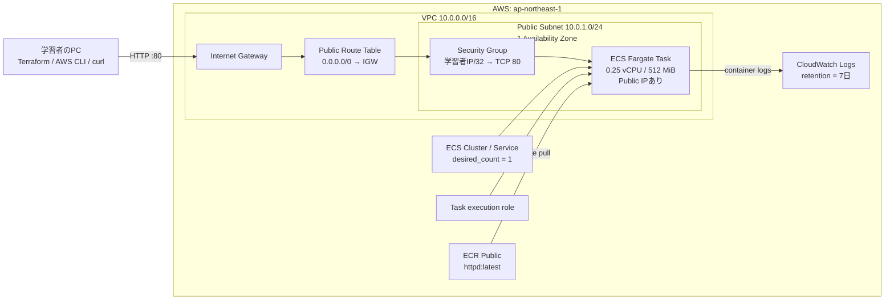

# Terraform ではじめる ECS Fargate 最小構成ハンズオン

## 目次

1. [このハンズオンのゴール](#1-このハンズオンのゴール)
2. [今回の構成と割り切り](#2-今回の構成と割り切り)
3. [費用とセキュリティの注意](#3-費用とセキュリティの注意)
4. [事前準備](#4-事前準備)
5. [Terraform ファイルを作る](#5-terraform-ファイルを作る)
6. [Terraform を初期化する](#6-terraform-を初期化する)
7. [Plan で変更内容を読む](#7-plan-で変更内容を読む)
8. [AWS に構築する](#8-aws-に構築する)
9. [Fargate タスクへアクセスする](#9-fargate-タスクへアクセスする)
10. [ログと ECS の状態を確認する](#10-ログと-ecs-の状態を確認する)
11. [AWS リソースを削除する](#11-aws-リソースを削除する)
12. [トラブルシューティング](#12-トラブルシューティング)
13. [この後の発展順](#13-この後の発展順)
14. [公式リファレンス](#14-公式リファレンス)
15. [更新履歴](#15-更新履歴)
16. [要確認・ヒアリング項目](#16-要確認ヒアリング項目)

## 1. このハンズオンのゴール

このハンズオンでは、Terraform の導入から始めて、AWS 上で Web コンテナを 1 個動かし、確認後にすべて削除する。

完了時には、次の関係を説明できる状態を目指す。

- Terraform の `init`、`fmt`、`validate`、`plan`、`apply`、`destroy`
- VPC、Subnet、Route Table、Internet Gateway、Security Group
- ECS Cluster、Task Definition、Task、Service
- ECS task execution role と CloudWatch Logs
- Fargate タスクの ENI と Public IP
- Terraform state の役割

今回作るコンテナは、まず AWS 公式手順でも利用されている ECR Public 上の Apache HTTP Server イメージとする。`devlab-board` の Go コンテナを ECR へ登録する作業は次のハンズオンに分ける。

## 2. 今回の構成と割り切り

編集可能な構成図は [`ecs-fargate-minimum-handson-architecture.drawio`](./ecs-fargate-minimum-handson-architecture.drawio) を参照する。



最初の理解対象を絞るため、次は作らない。

- Application Load Balancer
- NAT Gateway と Private Subnet
- 独自 ECR repository
- Auto Scaling
- RDS / ElastiCache
- Route 53 / ACM / HTTPS
- Terraform remote backend
- GitHub Actions / OIDC

Fargate タスクは `awsvpc` network mode を使い、タスクごとに ENI を持つ。今回は Public Subnet 上の ENI に Public IP を割り当てる。構築要素が少なく疎通を追いやすい一方、タスクを直接インターネットへ公開するため、本番向けの構成ではない。

## 3. 費用とセキュリティの注意

### 3.1 費用

このハンズオンは無料とは限らない。少なくとも次の利用料金が発生し得る。

- Fargate の vCPU / memory 利用時間
- Fargate タスクに付与する Public IPv4 address
- CloudWatch Logs の取り込みと保存
- データ転送

ALB と NAT Gateway は作らないため、それらの時間課金は発生しない。価格は変更されるため、実施前に [AWS Fargate Pricing](https://aws.amazon.com/fargate/pricing/)、[Amazon VPC Pricing](https://aws.amazon.com/vpc/pricing/)、[Amazon CloudWatch Pricing](https://aws.amazon.com/cloudwatch/pricing/) を確認する。

学習を中断するときは `desired_count = 1` のまま放置せず、原則として「11. AWS リソースを削除する」まで実施する。AWS Budgets の通知は請求を強制停止する仕組みではなく、反映にも時間差があるため、`terraform destroy` の代わりにはならない。

### 3.2 セキュリティ

- AWS root user は使わない。
- credentials、token、Terraform state、plan file を Git に commit しない。
- HTTP の inbound は、自分が現在利用している Public IPv4 の `/32` だけ許可する。
- コンテナには secret を渡さない。
- 今回の task execution role は、image pull と log 配信に必要な実行基盤用権限である。アプリから AWS API を呼ぶ task role とは別物である。
- 会社や学校の AWS account では、作成前に管理者のルールと利用可能な IAM role を確認する。

## 4. 事前準備

### 4.1 必要なもの

- AWS account と、学習用 account / role
- `ap-northeast-1` で次を操作できる権限
  - VPC、Subnet、Route Table、Internet Gateway、Security Group、ENI
  - ECS Cluster、Task Definition、Service、Task
  - IAM role の作成、policy attachment、`iam:PassRole`
  - CloudWatch Logs log group
- Terraform CLI
- AWS CLI v2
- `curl`

権限不足の解決として、普段使う本番 account へ無条件に AdministratorAccess を追加しない。個人の学習用 account、または管理者から払い出された一時 role を使う。

### 4.2 Terraform をインストールする

macOS で Homebrew を利用する場合は次を実行する。

```bash
brew tap hashicorp/tap
brew install hashicorp/tap/terraform
terraform version
```

Windows / Linux を含む他の方法は [HashiCorp の Install Terraform](https://developer.hashicorp.com/terraform/install) に従う。

期待する確認結果:

- `terraform version` がバージョン情報を返す
- この教材では Terraform `1.10` 以上 `2.0` 未満を利用する

### 4.3 AWS CLI v2 をインストールする

[AWS CLI の公式インストール手順](https://docs.aws.amazon.com/cli/latest/userguide/getting-started-install.html) に従い、次を確認する。

```bash
aws --version
```

### 4.4 AWS CLI profile を準備する

IAM Identity Center を利用できる環境では、長期 access key より SSO profile を優先する。

```bash
aws configure sso --profile devlab-board-dev
aws sso login --profile devlab-board-dev
export AWS_PROFILE=devlab-board-dev
export AWS_REGION=ap-northeast-1
aws sts get-caller-identity
```

`aws sts get-caller-identity` の `Account` と `Arn` を読み、意図した学習用 account / role であることを確認する。SSO を利用できない場合は、所属環境で定められた一時 credentials の設定方法を使う。credentials をリポジトリ内へ保存してはいけない。

チェックポイント:

- どの AWS account に作るか説明できる
- region が `ap-northeast-1` である
- root user の credentials を使っていない

### 4.5 作業ディレクトリを作る

リポジトリの root から次のディレクトリを作り、移動する。

```bash
mkdir -p infra/ecs-fargate/terraform
cd infra/ecs-fargate/terraform
```

このハンズオンでは、既存の `infra/envs/dev` と module 群を変更しない。EC2 Auto Scaling 用の骨格と ECS Fargate の学習 state を混ぜないためである。

## 5. Terraform ファイルを作る

最初は module 化せず、リソース間の参照を 1 ディレクトリで追う。次の 4 ファイルをエディタで作る。

```text
infra/ecs-fargate/terraform/
├── versions.tf
├── variables.tf
├── main.tf
└── outputs.tf
```

### 5.1 `versions.tf`

Terraform 本体と AWS provider の条件、provider の region、共通 tags を定義する。

```hcl
terraform {
  required_version = ">= 1.10, < 2.0"

  required_providers {
    aws = {
      source  = "hashicorp/aws"
      version = "~> 6.0"
    }
  }
}

provider "aws" {
  region = var.aws_region

  default_tags {
    tags = {
      Project     = var.project_name
      Environment = var.environment
      ManagedBy   = "Terraform"
      Purpose     = "ECS Fargate hands-on"
    }
  }
}
```

ここでは local backend を使うため、`backend` block はまだ書かない。state はこの作業ディレクトリの `terraform.tfstate` に保存される。

### 5.2 `variables.tf`

環境差分と、公開範囲を variable にする。

```hcl
variable "aws_region" {
  description = "AWS resources を作成する region"
  type        = string
  default     = "ap-northeast-1"
}

variable "project_name" {
  description = "Resource name と tag に使用する project 名"
  type        = string
  default     = "devlab-board"
}

variable "environment" {
  description = "学習環境を識別する名前"
  type        = string
  default     = "handson"
}

variable "allowed_http_cidr" {
  description = "Fargate task の TCP 80 へ接続できる Public IPv4 CIDR"
  type        = string

  validation {
    condition     = can(cidrnetmask(var.allowed_http_cidr))
    error_message = "allowed_http_cidr には 203.0.113.10/32 のような IPv4 CIDR を指定してください。"
  }
}

variable "container_image" {
  description = "ECS task で実行する container image"
  type        = string
  default     = "public.ecr.aws/docker/library/httpd:latest"
}
```

`allowed_http_cidr` には default を設けない。意図せず `0.0.0.0/0` へ公開することを避けるためである。

### 5.3 `main.tf`

network、security、IAM、logs、ECS の順に読む。

```hcl
data "aws_availability_zones" "available" {
  state = "available"
}

locals {
  name_prefix = "${var.project_name}-${var.environment}"
}

# --- Network ---

resource "aws_vpc" "main" {
  cidr_block           = "10.0.0.0/16"
  enable_dns_support   = true
  enable_dns_hostnames = true

  tags = {
    Name = "${local.name_prefix}-vpc"
  }
}

resource "aws_internet_gateway" "main" {
  vpc_id = aws_vpc.main.id

  tags = {
    Name = "${local.name_prefix}-igw"
  }
}

resource "aws_subnet" "public" {
  vpc_id                  = aws_vpc.main.id
  cidr_block              = "10.0.1.0/24"
  availability_zone       = data.aws_availability_zones.available.names[0]
  map_public_ip_on_launch = true

  tags = {
    Name = "${local.name_prefix}-public-subnet"
  }
}

resource "aws_route_table" "public" {
  vpc_id = aws_vpc.main.id

  route {
    cidr_block = "0.0.0.0/0"
    gateway_id = aws_internet_gateway.main.id
  }

  tags = {
    Name = "${local.name_prefix}-public-rt"
  }
}

resource "aws_route_table_association" "public" {
  subnet_id      = aws_subnet.public.id
  route_table_id = aws_route_table.public.id
}

# --- Security ---

resource "aws_security_group" "task" {
  name        = "${local.name_prefix}-task-sg"
  description = "Allow HTTP from the learner public IP"
  vpc_id      = aws_vpc.main.id

  tags = {
    Name = "${local.name_prefix}-task-sg"
  }
}

resource "aws_vpc_security_group_ingress_rule" "http" {
  security_group_id = aws_security_group.task.id
  description       = "HTTP from learner public IP"
  cidr_ipv4         = var.allowed_http_cidr
  from_port         = 80
  ip_protocol       = "tcp"
  to_port           = 80
}

resource "aws_vpc_security_group_egress_rule" "all" {
  security_group_id = aws_security_group.task.id
  description       = "Allow image pull and AWS API access"
  cidr_ipv4         = "0.0.0.0/0"
  ip_protocol       = "-1"
}

# --- Logs ---

resource "aws_cloudwatch_log_group" "app" {
  name              = "/ecs/${local.name_prefix}"
  retention_in_days = 7
}

# --- IAM for the ECS/Fargate agent ---

data "aws_iam_policy_document" "task_execution_assume_role" {
  statement {
    actions = ["sts:AssumeRole"]

    principals {
      type        = "Service"
      identifiers = ["ecs-tasks.amazonaws.com"]
    }
  }
}

resource "aws_iam_role" "task_execution" {
  name               = "${local.name_prefix}-task-execution-role"
  assume_role_policy = data.aws_iam_policy_document.task_execution_assume_role.json
}

resource "aws_iam_role_policy_attachment" "task_execution" {
  role       = aws_iam_role.task_execution.name
  policy_arn = "arn:aws:iam::aws:policy/service-role/AmazonECSTaskExecutionRolePolicy"
}

# --- ECS ---

resource "aws_ecs_cluster" "main" {
  name = "${local.name_prefix}-cluster"
}

resource "aws_ecs_task_definition" "app" {
  family                   = "${local.name_prefix}-task"
  requires_compatibilities = ["FARGATE"]
  network_mode             = "awsvpc"
  cpu                      = "256"
  memory                   = "512"
  execution_role_arn       = aws_iam_role.task_execution.arn

  runtime_platform {
    operating_system_family = "LINUX"
    cpu_architecture        = "X86_64"
  }

  container_definitions = jsonencode([
    {
      name      = "app"
      image     = var.container_image
      essential = true

      portMappings = [
        {
          containerPort = 80
          hostPort      = 80
          protocol      = "tcp"
        }
      ]

      logConfiguration = {
        logDriver = "awslogs"
        options = {
          awslogs-group         = aws_cloudwatch_log_group.app.name
          awslogs-region        = var.aws_region
          awslogs-stream-prefix = "app"
        }
      }
    }
  ])
}

resource "aws_ecs_service" "app" {
  name                   = "${local.name_prefix}-service"
  cluster                = aws_ecs_cluster.main.id
  task_definition        = aws_ecs_task_definition.app.arn
  desired_count          = 1
  launch_type            = "FARGATE"
  platform_version       = "LATEST"
  wait_for_steady_state  = true
  enable_execute_command = false

  network_configuration {
    subnets          = [aws_subnet.public.id]
    security_groups  = [aws_security_group.task.id]
    assign_public_ip = true
  }

  deployment_circuit_breaker {
    enable   = true
    rollback = true
  }

  depends_on = [
    aws_iam_role_policy_attachment.task_execution,
    aws_route_table_association.public,
  ]
}
```

`cpu = "256"` と `memory = "512"` は、Linux Fargate で利用できる最小の組み合わせである。`execution_role_arn` は ECS/Fargate agent が image を取得し、CloudWatch Logs へ log を送るために使う。今回はアプリ自身が AWS API を呼ばないため、`task_role_arn` は定義しない。

### 5.4 `outputs.tf`

確認コマンドから参照する名前を output にする。

```hcl
output "aws_region" {
  description = "AWS region"
  value       = var.aws_region
}

output "ecs_cluster_name" {
  description = "ECS cluster name"
  value       = aws_ecs_cluster.main.name
}

output "ecs_service_name" {
  description = "ECS service name"
  value       = aws_ecs_service.app.name
}

output "cloudwatch_log_group_name" {
  description = "Container logs の CloudWatch Logs log group"
  value       = aws_cloudwatch_log_group.app.name
}
```

## 6. Terraform を初期化する

### 6.1 自分の Public IPv4 を環境変数へ設定する

```bash
export TF_VAR_allowed_http_cidr="$(curl --fail --silent https://checkip.amazonaws.com)/32"
printf '%s\n' "$TF_VAR_allowed_http_cidr"
```

`198.51.100.24/32` のように、末尾が `/32` になっていることを確認する。VPN、会社 proxy、テザリングの切り替え後は IP が変わる可能性があるため、再取得する。

### 6.2 format と初期化

```bash
terraform fmt
terraform init
terraform providers
terraform validate
```

`terraform init` は主に次を行う。

- backend の初期化。今回は local backend
- `hashicorp/aws` provider の取得
- `.terraform.lock.hcl` への provider 選択結果の記録

Git では次のように扱う。

| Path | Commit | 理由 |
| --- | --- | --- |
| `*.tf` | する | Infrastructure as Code 本体 |
| `.terraform.lock.hcl` | する | provider 選択を再現するため |
| `.terraform/` | しない | local dependency / cache |
| `terraform.tfstate*` | しない | resource 情報や機微情報を含み得る |
| `*.tfplan` | しない | plan に値や機微情報を含み得る |
| `*.tfvars` | しない | credentials や secret を置かないが、local 値の誤 commit を避ける |

チェックポイント:

- `terraform validate` が `Success!` を返す
- `.terraform.lock.hcl` と `.terraform/` の役割の違いを説明できる
- AWS resource はまだ作成されていないと理解している

## 7. Plan で変更内容を読む

認証対象を再確認する。

```bash
aws sts get-caller-identity
printf 'AWS_PROFILE=%s AWS_REGION=%s ALLOWED_CIDR=%s\n' \
  "$AWS_PROFILE" "$AWS_REGION" "$TF_VAR_allowed_http_cidr"
```

plan を保存する。

```bash
terraform plan -out=handson.tfplan
terraform show handson.tfplan
```

少なくとも次を確認する。

- delete / replace ではなく、新規 create が中心である
- region と resource name が意図どおりである
- Security Group の ingress が `0.0.0.0/0` ではなく自分の `/32` である
- ECS Service の `desired_count` が `1`
- Fargate task が `cpu = 256`、`memory = 512`
- ECS Service が Public IP を割り当てる

`handson.tfplan` は commit しない。`apply` 後に削除するか、最後の `destroy` 後に削除する。

## 8. AWS に構築する

保存した plan を適用する。

```bash
terraform apply handson.tfplan
```

`apply` が成功したら、Terraform 管理対象を確認する。

```bash
terraform state list
terraform output
```

ここで state は「Terraform が管理する AWS resource と、設定中の resource address の対応表」と捉える。AWS console で手動変更すると、設定・state・実環境の間に差分が生まれるため、このハンズオン中は手動編集しない。

チェックポイント:

- ECS Cluster はコンテナそのものではない
- Task Definition は実行設計図、Task は実体、Service は desired count を維持する仕組み
- EC2 instance を自分で作っていないことを確認できる

## 9. Fargate タスクへアクセスする

ALB がないため、実行中 task の ENI から Public IP を調べる。

```bash
export ECS_CLUSTER="$(terraform output -raw ecs_cluster_name)"
export ECS_SERVICE="$(terraform output -raw ecs_service_name)"

aws ecs wait services-stable \
  --cluster "$ECS_CLUSTER" \
  --services "$ECS_SERVICE"

export TASK_ARN="$(aws ecs list-tasks \
  --cluster "$ECS_CLUSTER" \
  --service-name "$ECS_SERVICE" \
  --desired-status RUNNING \
  --query 'taskArns[0]' \
  --output text)"

export ENI_ID="$(aws ecs describe-tasks \
  --cluster "$ECS_CLUSTER" \
  --tasks "$TASK_ARN" \
  --query 'tasks[0].attachments[0].details[?name==`networkInterfaceId`].value | [0]' \
  --output text)"

export TASK_PUBLIC_IP="$(aws ec2 describe-network-interfaces \
  --network-interface-ids "$ENI_ID" \
  --query 'NetworkInterfaces[0].Association.PublicIp' \
  --output text)"

printf 'TASK_ARN=%s\nENI_ID=%s\nTASK_PUBLIC_IP=%s\n' \
  "$TASK_ARN" "$ENI_ID" "$TASK_PUBLIC_IP"

curl --fail --show-error "http://$TASK_PUBLIC_IP"
```

Apache HTTP Server の HTML が返れば成功である。

Public IP は固定ではない。Service が task を置き換えると変わることがある。この不安定さも、次段階で ALB を導入する理由の一つになる。

## 10. ログと ECS の状態を確認する

### 10.1 ECS Service と Task

```bash
aws ecs describe-services \
  --cluster "$ECS_CLUSTER" \
  --services "$ECS_SERVICE" \
  --query 'services[0].{status:status,desired:desiredCount,running:runningCount,pending:pendingCount,taskDefinition:taskDefinition}'

aws ecs describe-tasks \
  --cluster "$ECS_CLUSTER" \
  --tasks "$TASK_ARN" \
  --query 'tasks[0].{lastStatus:lastStatus,healthStatus:healthStatus,launchType:launchType,cpu:cpu,memory:memory}'
```

`desired = 1`、`running = 1`、`lastStatus = RUNNING` が基本の確認点になる。

### 10.2 CloudWatch Logs

```bash
export LOG_GROUP="$(terraform output -raw cloudwatch_log_group_name)"
aws logs tail "$LOG_GROUP" --since 10m
```

HTTP access log がまだなければ、もう一度 `curl "http://$TASK_PUBLIC_IP"` を実行してから確認する。

### 10.3 Terraform の差分

```bash
terraform plan
```

手動変更をしていなければ `No changes` になることを確認する。これは、設定・state・実環境が一致しているという意味である。

## 11. AWS リソースを削除する

課金停止までがハンズオンである。別の shell を開いた場合は、profile、region、CIDR を再設定してから進める。

```bash
export AWS_PROFILE=devlab-board-dev
export AWS_REGION=ap-northeast-1
export TF_VAR_allowed_http_cidr="$(curl --fail --silent https://checkip.amazonaws.com)/32"
aws sts get-caller-identity
```

削除 plan を読み、対象 account を再確認する。

```bash
terraform plan -destroy
terraform destroy
```

`terraform destroy` の確認には `yes` と入力する。完了後に確認する。

```bash
terraform state list
rm handson.tfplan
```

`terraform state list` が何も返さないことを確認する。AWS console でも ECS Cluster、実行中 Task、CloudWatch Logs log group、VPC が残っていないことを確認する。

`terraform destroy` が途中で失敗した場合、state や `.tf` を先に削除してはいけない。エラーを解決して再実行する。

## 12. トラブルシューティング

### 12.1 `AccessDenied` / `UnauthorizedOperation`

表示された action と resource を読む。特に IAM role 作成と `iam:PassRole` は不足しやすい。account 管理者へ、エラー全文、対象 account、region、このハンズオンで作る resource を伝える。credentials の貼り付けや共有はしない。

### 12.2 ECS Service が安定しない

Service event と停止 task の理由を確認する。

```bash
aws ecs describe-services \
  --cluster "$ECS_CLUSTER" \
  --services "$ECS_SERVICE" \
  --query 'services[0].events[0:10].[createdAt,message]' \
  --output table

aws ecs list-tasks \
  --cluster "$ECS_CLUSTER" \
  --service-name "$ECS_SERVICE" \
  --desired-status STOPPED
```

停止 task ARN が返ったら、次を実行する。

```bash
aws ecs describe-tasks \
  --cluster "$ECS_CLUSTER" \
  --tasks TASK_ARNをここへ指定 \
  --query 'tasks[0].{stopCode:stopCode,stoppedReason:stoppedReason,containers:containers[*].reason}'
```

### 12.3 `CannotPullContainerError`

次を確認する。

- subnet が Internet Gateway への `0.0.0.0/0` route を持つ
- ECS Service の `assign_public_ip` が `true`
- Security Group の egress が image pull を妨げていない
- ECR Public の image 名が正しい
- task execution role が正しく引き受けられる

### 12.4 `curl` が timeout する

次を確認する。

- task が `RUNNING`
- task の置き換え後に Public IP を再取得した
- `TF_VAR_allowed_http_cidr` が現在の自分の Public IPv4 と一致する
- VPN / proxy / tethering の切り替えで送信元 IP が変わっていない
- TCP port 80 を組織 network が遮断していない

Public IP が変わった場合は、新しい CIDR を設定して反映する。

```bash
export TF_VAR_allowed_http_cidr="$(curl --fail --silent https://checkip.amazonaws.com)/32"
terraform plan
terraform apply
```

### 12.5 `terraform destroy` が失敗する

- `aws sts get-caller-identity` で apply 時と同じ account / role か確認する
- region と working directory を確認する
- AWS console で resource を先に手動削除しない
- dependency 削除待ちの場合は、少し待ってから同じ `terraform destroy` を再実行する

## 13. この後の発展順

この最小構成を一度 destroy できた後、次の順に小さく拡張する。

1. ECR private repository を作り、`backend/Dockerfile` から `devlab-board` の Go API image を push する
2. `/healthz` を container health check と smoke check に使う
3. 2 つの Public Subnet と ALB を追加し、task への inbound を ALB Security Group だけに絞る
4. task を Private Subnet へ移し、Public IP を無効化する
5. NAT Gateway と ECR / Logs VPC endpoint の cost・可用性を比較する
6. RDS PostgreSQL、Secrets Manager、migration 手順を追加する
7. ElastiCache Redis を追加し、`SESSION_STORE=redis` を検証する
8. S3 + CloudFront で frontend を配信する
9. S3 backend と state locking を導入する
10. GitHub Actions + OIDC で plan / deploy を自動化する

本番候補では、少なくとも Multi-AZ、ALB、HTTPS、Private Subnet、secret 管理、監視、rollback、remote state を改めて設計する。このハンズオン構成をそのまま本番化しない。

## 14. 公式リファレンス

- [Install Terraform](https://developer.hashicorp.com/terraform/install)
- [`terraform init` command](https://developer.hashicorp.com/terraform/cli/commands/init)
- [AWS CLI のインストール](https://docs.aws.amazon.com/cli/latest/userguide/getting-started-install.html)
- [AWS CLI と IAM Identity Center](https://docs.aws.amazon.com/cli/latest/userguide/cli-configure-sso.html)
- [Amazon ECS Linux task for Fargate](https://docs.aws.amazon.com/AmazonECS/latest/developerguide/ECS_AWSCLI_Fargate.html)
- [Fargate task networking](https://docs.aws.amazon.com/AmazonECS/latest/developerguide/fargate-task-networking.html)
- [Fargate task definition differences](https://docs.aws.amazon.com/AmazonECS/latest/developerguide/fargate-tasks-services.html)
- [Amazon ECS task execution IAM role](https://docs.aws.amazon.com/AmazonECS/latest/developerguide/task_execution_IAM_role.html)
- [Terraform AWS Provider: `aws_ecs_service`](https://registry.terraform.io/providers/hashicorp/aws/latest/docs/resources/ecs_service)
- [Terraform AWS Provider: `aws_ecs_task_definition`](https://registry.terraform.io/providers/hashicorp/aws/latest/docs/resources/ecs_task_definition)
- [AWS Fargate Pricing](https://aws.amazon.com/fargate/pricing/)
- [Amazon VPC Pricing](https://aws.amazon.com/vpc/pricing/)

## 15. 更新履歴

| 日付 | 内容 |
| --- | --- |
| 2026-07-24 | 編集可能な Draw.io 構成図へのリンクを追加 |
| 2026-07-23 | Terraform 導入から ECS Fargate 最小構成の作成・確認・削除までを新規作成 |

## 16. 要確認・ヒアリング項目

次のハンズオンへ進む前に決める。

- AWS account は個人学習用か、組織管理 account か
- AWS 認証は IAM Identity Center を使えるか
- 次は ECR + Go backend を先に扱うか、ALB + 2 AZ を先に扱うか
- dev 環境を常時稼働させるか、学習ごとに destroy するか
- remote state 用 S3 bucket を別 bootstrap 構成として管理するか
